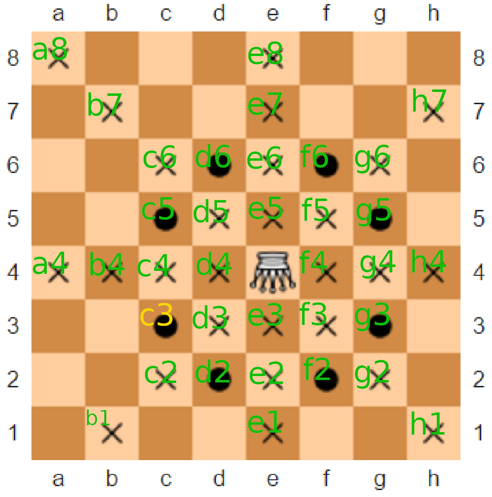
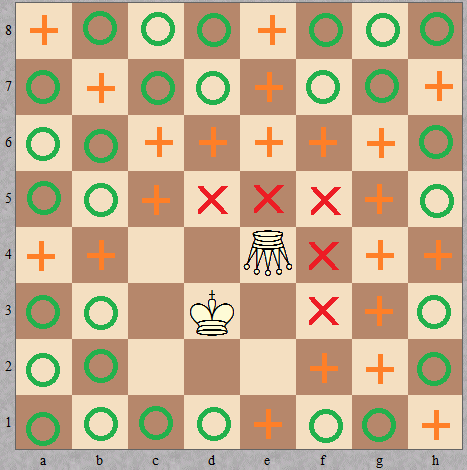
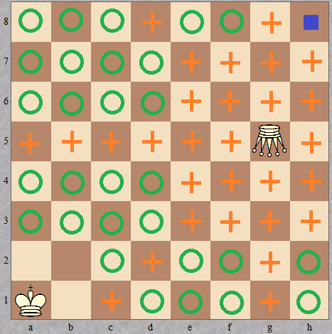

# Amazon Checkmate

An amazon (also known as a queen + knight compound) is an imaginary chess piece that can move like a queen or a knight (or, equivalently, like a rook, bishop, or knight). The diagram below shows all squares which the amazon can attack from e4 (circles represent knight-like moves while crosses correspond to queen-like moves).

Recently, you've come across a diagram with only three pieces left on the board: a white amazon, the white king, and the black king. It's black's move. You don't have time to determine whether the game is over or not, but you'd like to figure it out in your head. Unfortunately, the diagram is smudged and you can't see the position of the black king, so you'll need to consider all possible positions.

Given the positions of the white pieces on a standard chessboard (using algebraic notation), your task is to determine the number of possible black king's positions such that:

it's checkmate (i.e. black's king is under the amazon's attack and it cannot make a valid move);
it's check (i.e. black's king is under the amazon's attack but it can reach a safe square in one move);
it's stalemate (i.e. black's king is on a safe square but it cannot make a valid move);
black's king is on a safe square and it can make a valid move.
Note that two kings cannot be placed on two adjacent squares (including two diagonally adjacent ones).

## Examples with images.

## For king = "d3" and amazon = "e4"

For king = "d3" and amazon = "e4", the output should be
amazonCheckmate(king, amazon) = [5, 21, 0, 29].

## For king = "d3" and amazon = "e4"

For king = "a1" and amazon = "g5", the output should be
amazonCheckmate(king, amazon) = [0, 29, 1, 29].

## Open test cases.
- 1)  Input:
king: "d3"
amazon: "e4"
Expected Output:
`[5, 21, 0, 29]`

- 2) Input:
king: "a1"
amazon: "g5"
Expected Output:
`[0, 29, 1, 29]`

- 3) Input:
king: "a3"
amazon: "e4"
Expected Output:
`[1, 32, 1, 23]`

- 4) Input:
king: "f3"
amazon: "f2"
Expected Output:
`[6, 11, 0, 38]`

- 5) Input:
king: "b7"
amazon: "a8"
Expected Output:
`[0, 10, 0, 45]`

- 6) Input:
king: "f7"
amazon: "d3"
Expected Output:
`[4, 28, 1, 21]`

- 7) Input:
king: "g2"
amazon: "c3"
Expected Output:
`[9, 21, 0, 24]`

- 8) Input:
king: "f3"
amazon: "c1"
Expected Output:
`[4, 18, 0, 32]`

- 9) Input:
king: "d4"
amazon: "h8"
Expected Output:
`[0, 18, 0, 36]`
