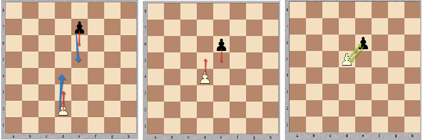

# [Pawn Race](https://app.codesignal.com/arcade/code-arcade/chess-tavern/ybkbv7e6qMaucZWig)

Pawn rase is a game for two people, played on an ordinary `8x8` chessboard. The first player has a white pawn, the second one - a black pawn. Initially the pawns are place somewere on the board so that the `1st` and the `8th` rows are not occupied. Players take turn to make a move.

White pawn moves upwards, black one moves downwards. The following moves are allowed:

- one-cell move on the same vertical in the allowed direction;
- two-cell move on the same vertical in the allwoed direction, if the pawn is standing o the `2nd` (for the white pawn) or the `7th` (for the black pawn) row. Note that even with the two-cell move a pawn can't jump over the opponent's pawn;
- capture move on cell forward in the allowed direction and one cell to the left of right.

The purpose of the game is to reach the `1st` row (for the black pawn), or the `8th` row (for the white one). ore to capture the opponent's pawn.

## Example

- For `white = "e2"`, `black = "e7"`, and `toMove =  'w'`, the output should be `pawnRace(white, black, toMove) = 'draw'`
- For `white = "e3"`, `black  = "d7"`, and `toMove = 'b'`, the output should be `pawnRace(white, black, toMove) = "balck"`
- For `white = "a7"`, `black = "h2"`, and `toMove = 'w'`, the ouput should be `pawnRace(white, black, toMove) = "white"`

## Input/Output

- **[exectuon time limit] 4 seconds (rb)**
- **[input] string white** coorditantes of the white pawn in the chess notation.
- **[input] string black** Position of the black pawin the the same notation. It is guaranteed that `white != black`.
- **[input]char toMove** `'w'` if it is the first player's turn `'b'` otherwise.
- **[output] string** 
        - `"white"`, `"black"` or `"draw"` depending on the result of the game.

## Comments

- @psam 3 of the hidden tests ar not even possible states of the game where the pawns are in the same column but already passed each other. sample test: `white: "b7"`, `black: "b4"`, `toMove: "w"`, `expected "white"`.

### Notes

In front of you - method. ==> 'draw'