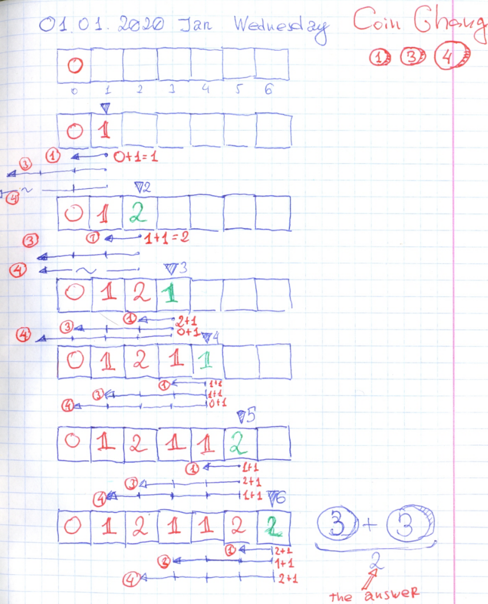

# DP: Sum and Coin Change. Leetcode: 931. Minimum Falling Path Sum.

- https://leetcode.com/discuss/general-discussion/458695/dynamic-programming-patterns
- https://youtu.be/1mtvm2ubHCY?t=367
- https://leetcode.com/problems/minimum-falling-path-sum/discuss/467288/Ruby%3A-100100.
- https://gist.github.com/lbvf50mobile/29893240d558762d4b3e9344c53102e7#file-fastest-rb-L8



This is a DP solution. Do not touch the first row. Than modify each next row element:
 `a[x][i] = a[x][i] + min(a[x-1][i],a[x-1][i-1],a[x-1][i+1])` 
But need to remember about array bounds.  At the end select minimum value of the last row.

This is the solution after optimization. It is not in Ruby style, it's more like "C" style coded.  Below I add the Ruby style solution, where it's more readlale and reasy to read. Also the soluton below ueses some Ruby language tools.

Fast solution: 
```Ruby
# 931. Minimum Falling Path Sum
# https://leetcode.com/problems/minimum-falling-path-sum/
# Runtime: 44 ms, faster than 100.00% of Ruby online submissions for Minimum Falling Path Sum.
# Memory Usage: 10.1 MB, less than 100.00% of Ruby online submissions for Minimum Falling Path Sum.
# @param {Integer[][]} a
# @return {Integer}

def min_falling_path_sum(a)
    return a[0].min if a.size == 1 #!!!!
    min = 0
    (1...a.size).each do |row|
        (0...a[0].size).each do |i|
            x = a[row-1][i]
            if i - 1 >= 0
                x = a[row-1][i-1] if x > a[row-1][i-1]
            end
            if i + 1 < a[0].size
                x = a[row-1][i+1] if x > a[row-1][i+1]
            end
            a[row][i] += x
            if i.zero?
                min = a[row][i]
            else
                min = a[row][i] if a[row][i] < min
            end
        end
    end
    
    min
end
```

Readable solution:
```Ruby
# 931. Minimum Falling Path Sum
# https://leetcode.com/problems/minimum-falling-path-sum/
# Runtime: 84 ms, faster than 16.67% of Ruby online submissions for Minimum Falling Path Sum.
# Memory Usage: 9.6 MB, less than 100.00% of Ruby online submissions for Minimum Falling Path Sum.
# @param {Integer[][]} a
# @return {Integer}

def min_falling_path_sum(a)
    get = ->(row,i){
            [-1,1,0]
            .map{|x| x + i}
            .select{|x| x.between?(0,a[0].size-1)}
            .map{|x| a[row-1][x]}
            .min
        }
    (1...a.size).each do |row|
        (0...a[0].size).each do |i|
            a[row][i] += get[row,i]
        end
    end
    
    a.last.min
end
```

P.S.
- https://youtu.be/YBSt1jYwVfU
-  https://www.manning.com/books/grokking-algorithms
-  https://leetcode.com/discuss/general-discussion/458695/dynamic-programming-patterns