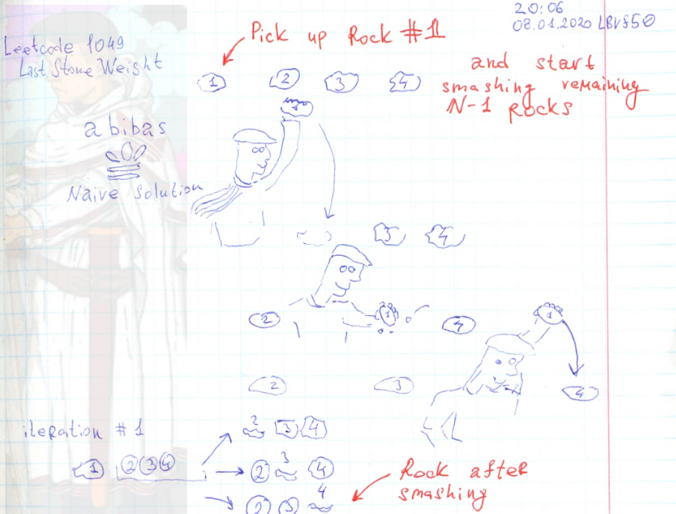

# Leetcode: Naive + Knapsack solution 1049. Last Stone Weight II.

- https://leetcode.com/problems/last-stone-weight-ii/
- https://gist.github.com/lbvf50mobile/56a1c943c34525891beb9b95da29365f#file-experement-rb-L7
- https://leetcode.com/problems/last-stone-weight-ii/discuss/387871/Java-fast-solution-with-real-memory-amount-and-straight-forward-explanation


### One more naive solution I called it Abibas Naive Solution

One more naive solution that I called **Abibas Naive Solution**




When there are N rocks, select rock number one, and smash remained N-1 rocks by this one. This approach will generate N-1 sub arrays with size of N-1. It could be recursion, or this sub arrays could be pushed into the queue.

To calculate complexity I thought like this:

- N gives N-1
- N-1 gives N-2 subarrays
- N-2 give N-3.

If there are 4 rocks in the initial array, the recursive call tree would have 3 levels. And N rocks give N-1 leves.
Now Let calculate the width of this tree:

- 1
- n-1
- (n-1)(n-2)
- (n-1)(n-2)(n-3)

`1 + (n-1) + (n-1)(n-2) + (n-1)(n-2)(n-3)` could be approximated into `n + n^2 + n^3` and get **O(n^(n-1))**  

but this is only number of arrays we have to consider, there also a size of arrays we need to iterate through. And size of array will have descending order

- N
- N-1
- N-2
- N-3

And now concatinate this calcualtaion together to get the time complexity of this task:

- N
- `(N-1)*(n-1)`
- `(N-2)*(n-1)(n-2)`
- `(N-3)*(n-1)(n-2)(n-3)`

And the total time comlexity will be `O(n^n)`. And even when I add memoization the problem does not solve by this algorithm.


```Ruby

# 1049. Last Stone Weight II
# https://leetcode.com/problems/last-stone-weight-ii/


# @param {Integer[]} stones
# @return {Integer}
def last_stone_weight_ii(stones)
    return 0 if stones.empty?
    return stones[0] if 1 == stones.size
    visited = {}
    visited[stones] = true
    queue = [[stones,stones.size,stones.sum]]
    dp = Array.new(stones.size+1)
    
    while ! queue.empty?
        heap,size,sum = queue.pop
        dp[size] ||= sum
        dp[size] = sum if sum < dp[size]
        hit_rock = heap.pop
        new_size = size -1 
        (0...new_size).each do |i|
            new_heap = []
            (0...new_size).each do |j|
                if i == j
                    element = (heap[j] - hit_rock).abs
                    new_heap.push(element) if element.nonzero?
                else
                    new_heap.push heap[j]
                end
            end
            if visited[new_heap].nil?
                visited[new_heap] = true
                queue.push([new_heap,new_heap.size,new_heap.sum])
            end
        end
    end
    return dp[0] if dp[0]
    return dp[1]
end
```

### Knapsack optimized soltion from the Leetcode Discuss.

https://leetcode.com/problems/last-stone-weight-ii/discuss/387871/Java-fast-solution-with-real-memory-amount-and-straight-forward-explanation

```Java
 /*
     * Key here is realizing task as kind of Knapsack problem. Why? Because:
     * - if we have only two stones result = abs(s1 - s2)
     * - if we have more than 2 stones we still can imagine this as two buckets with stones, while get stone from each bucket
     *   - if stones equal then mark matched stones on both buckets
     *   - if non equal mark as matched only common part of stones, but not diff (s1 - s2)
     *  => we should find how to divide stones to buckets with maximum matched stones. Obvious than every bucket
     *   sum no more than sum(stones) / 2
     *
     * We have nice limits 1 <= stones.length <= 30, 1 <= stones[i] <= 100, so we can constrict it with array
     *  dp[i] = {true if we can construct i as sum with stones, false otherwise}
     * we can do it dynamically:
     *  - with first stone we have only one sum = stone
     *  - with second we have in addition sum = s1 + s2
     *  - with N stone we have no more than N - 1 sums in addition
     * last step is finding max reachable sum less or equal to sum(stones) / 2
     */
    public int lastStoneWeightII(int[] stones) {
        int sum = 0;
        for (int s : stones) sum += s;

        boolean[] dp = new boolean[sum / 2 + 1];
        dp[0] = true;
        int sums = 1;

        for (int stone: stones) {
            int[] newSums = new int[sums];
            int index = 0;
            int s = stone;
            while (s <= sum / 2) {
                if (dp[s - stone] && !dp[s])
                    newSums[index++] = s;
                s++;
            }
            for (int i = 0; i < index; i++) {
               dp[newSums[i]] = true;
            }
            sums = sums + index;
        }
        for (int s = sum / 2; s >= 0; s--) {
            if (dp[s])
                return sum - s - s;
        }
        return 0;
    }
```