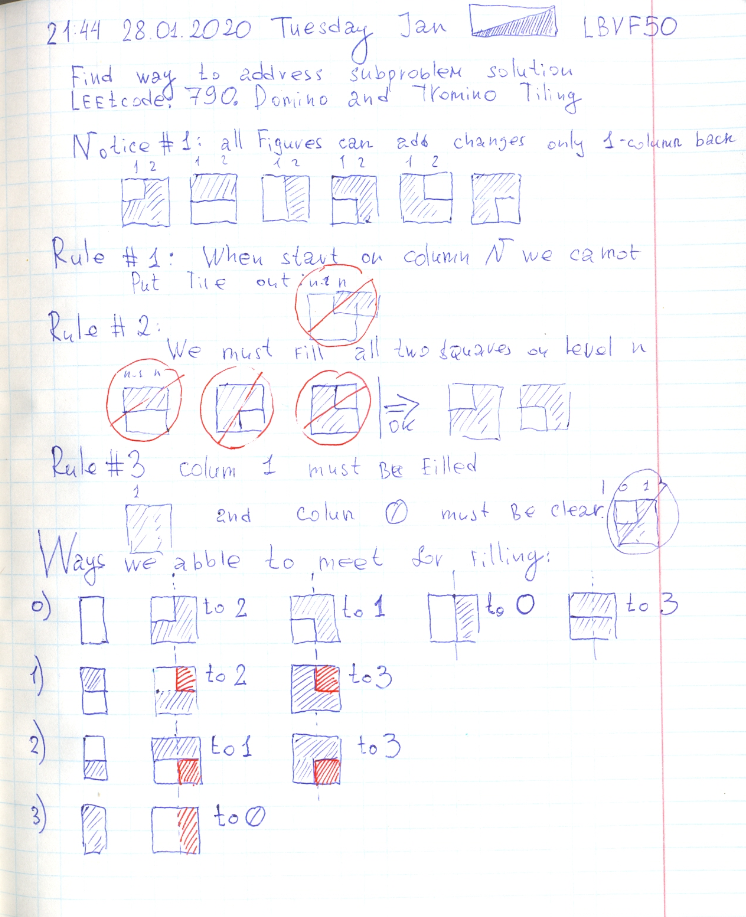

# Leetcode: 790. Domino and Tromino Tiling. Solution + image.

- https://leetcode.com/problems/domino-and-tromino-tiling/
- https://gist.github.com/lbvf50mobile/64698b20075fb0d2363a509b1c259c5f

I had a **bug** because copy past: ans = ans % **(10^9 + 7)**
And it is not a power in Ruby. Need to use `ans = ans % (10**9 + 7)`

```Ruby
# https://leetcode.com/problems/domino-and-tromino-tiling/
# Runtime: 48 ms, faster than 100.00% of Ruby online submissions for Domino and Tromino Tiling.
# Memory Usage: 11.7 MB, less than 100.00% of Ruby online submissions for Domino and Tromino Tiling.
# 790. Domino and Tromino Tiling
# @param {Integer} n
# @return {Integer}
def num_tilings(n)
    @dp = Array.new(n+1).map{ Array.new(4)}
    @moves = [[0,1,2,3],[2,3],[1,3],[0]]
    @dp[1][0] = 1
    @dp[1][1] = 0
    @dp[1][2] = 0
    @dp[1][3] = 1
    ans = rec(n,0)
    # @dp.each{|x| p x}
    ans
end

def rec(column,type)
    return @dp[column][type] if @dp[column][type]
    ans = 0
    @moves[type].each do |subtype|
        ans += rec(column-1,subtype)
    end
    ans = ans % (10**9 + 7)
    @dp[column][type] = ans
    ans
end
```

