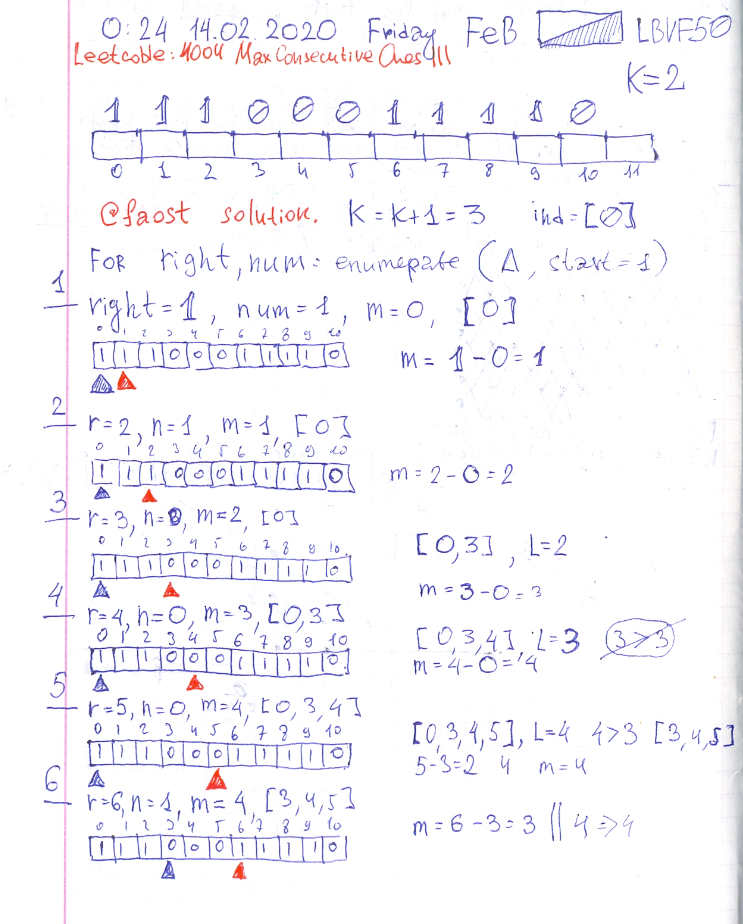
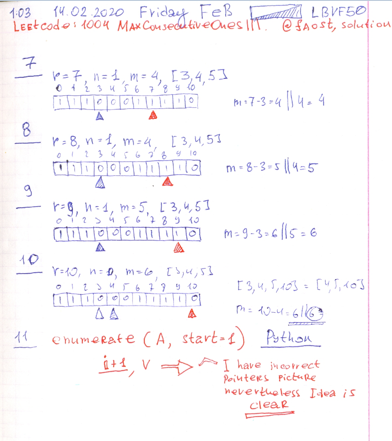

# Leetcode: 239. Sliding Window Maximum (IndicesQueue).

- https://leetcode.com/problems/sliding-window-maximum/
- https://gist.github.com/lbvf50mobile/e17c6e8aed628538dc28f35dd81ebd75
- https://hackernoon.com/14-patterns-to-ace-any-coding-interview-question-c5bb3357f6ed
- https://gist.github.com/lbvf50mobile/f419bc13b1aacf92141c4063dd282368
- https://gist.github.com/lbvf50mobile/735c5de144b099acd3a145e18c718952

 


```Ruby
# 239. Sliding Window Maximum
# https://leetcode.com/problems/sliding-window-maximum/
# Runtime: 112 ms, faster than 23.08% of Ruby online submissions for Sliding Window Maximum.
# Memory Usage: 13 MB, less than 100.00% of Ruby online submissions for Sliding Window Maximum.
# @param {Integer[]} nums
# @param {Integer} k
# @return {Integer[]}
def max_sliding_window(nums, k)
    return [] if nums.empty?
    answer = []
    queue = []
    (0...k).each do |i|
        queue.push(nums[i])
    end
    answer.push(queue.max)
    (k...nums.size).each do |i|
        queue.shift
        queue.push(nums[i])
        answer.push(queue.max)
    end
    answer
end
```