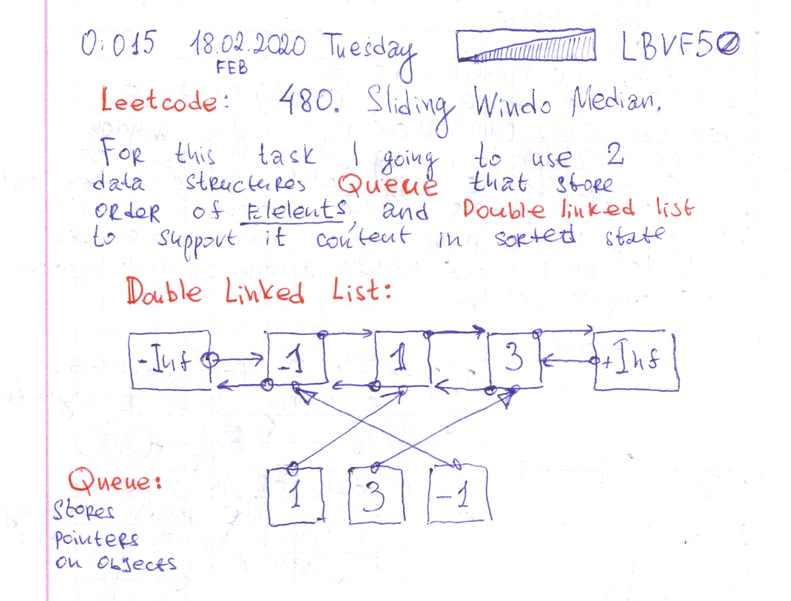

# Leetcode:  480. Sliding Window Median. 463. Island Perimeter.

- https://leetcode.com/problems/sliding-window-median/
- https://gist.github.com/lbvf50mobile/bbacbc666363d6d2c1f2660aad0dea6c
- https://leetcode.com/problems/sliding-window-median/discuss/475140/Python-SortedList-solution
- https://leetcode.com/problems/island-perimeter/discuss/512151/Ruby-simple-solution.
- https://leetcode.com/problems/island-perimeter/
- https://gist.github.com/lbvf50mobile/ef996882fdc600464b4273327abd7935

To solve this problem I used two data strucutres Queue and Linked List. Queue stores pointers to lined list, to delete elements in O(n) time.
But still it Time Limit Exceeded.



```Ruby
# 480. Sliding Window Median
# https://leetcode.com/problems/sliding-window-median/
# Time limit Exceed.
# [16807,282475249,622650073,...
# 3406
# @param {Integer[]} nums
# @param {Integer} k
# @return {Float[]}

class DoubleLinked
    def initialize()
        @start  = {v: -Float::INFINITY,r: nil}
        @end = {v: Float::INFINITY, l:nil}
        @start[:r] = @end
        @end[:l] = @start
    end
    def add(x)
        pointer = @start
        while pointer[:v] != Float::INFINITY
            if pointer[:v] <= x[:v] && x[:v] <= pointer[:r][:v]
                left = pointer
                right = pointer[:r]
                x[:l] = left
                x[:r] = right
                right[:l] = x
                left[:r] = x
                return
            end
            pointer = pointer[:r]
        end
        raise "out of range in add"
    end
    def del(e)
        x = e[:l]
        y = e[:r]
        x[:r] = y
        y[:l] = x
        e[:l] = nil
        e[:r] = nil
    end
    # return 1 indexed element from the list started from left
    def v(i)
        counter = 0
        pointer = @start
        while counter <= i && pointer[:v] != Float::INFINITY
            return pointer[:v] if counter == i
            counter += 1
            pointer = pointer[:r]
        end
        raise "out of range"
    end
end

def median_sliding_window(nums, k)
    return [] if nums.empty? || k.zero?
    nums.map!(&:to_f)
    list = DoubleLinked.new()
    return nums if 1 == k
    odd = k.odd?
    center, l_center, r_center= k/2+1, (k/2), (k/2+1)
    create = ->(x){ return {v: x, l: nil, r: nil}}
    answer = []
    queue = []
    median = ->(){
        if odd
            return list.v(center)
        else
            return (list.v(l_center) + list.v(r_center))/2
        end
    }
    # first sliding window
    (0...k).each do |i|
        v = nums[i]
        e = create[v]
        list.add(e)
        queue.push(e)
    end
    answer.push(median.())
    # lest positions of sliding window
    (k...nums.size).each do |i|
        e = queue.shift
        list.del(e)
        v = nums[i]
        e = create[v]
        list.add(e)
        queue.push(e)
        answer.push(median.())
    end
    answer 
end
```

```Ruby
# 463. Island Perimeter
# https://leetcode.com/problems/island-perimeter/
# Runtime: 116 ms, faster than 83.33% of Ruby online submissions for Island Perimeter.
# Memory Usage: 13.1 MB, less than 100.00% of Ruby online submissions for Island Perimeter.
# @param {Integer[][]} grid
# @return {Integer}
def island_perimeter(grid)
    return 0 if grid.empty?
    height = grid.size
    width = grid[0].size
    answer = 0
    (0...height).each do |i|
        (0...width).each do |j|
            if 1 == grid[i][j]
                perimeter = 4
                # check top
                perimeter -= 1 if i-1 >= 0 && 1 == grid[i-1][j]
                # check right
                perimeter -= 1 if j+1 < width && 1 == grid[i][j+1]
                # check bottom
                perimeter -= 1 if i+1 < height && 1 == grid[i+1][j]
                # check left 
                perimeter -= 1 if j-1 >= 0 && 1 == grid[i][j-1]
                answer += perimeter
            end
        end
    end
    
    answer
    
end
```