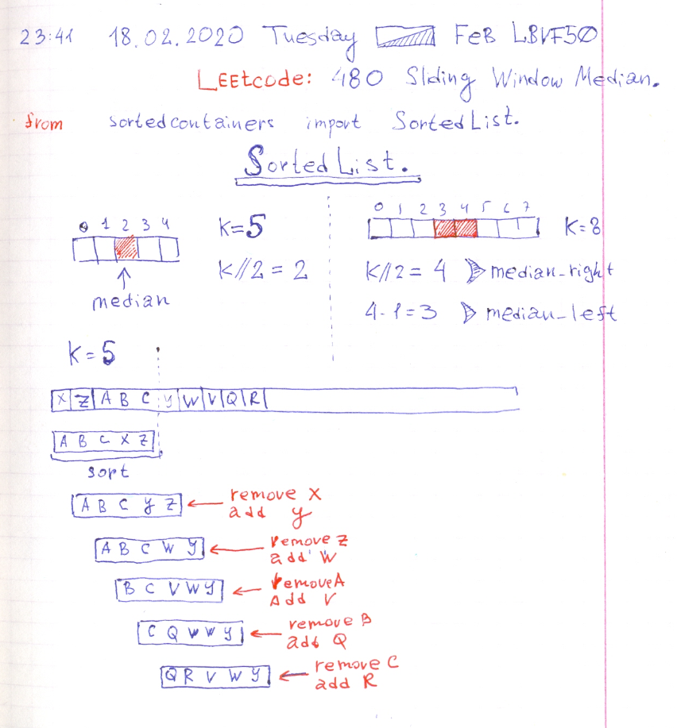

# Leetcode: Continuing task 480.

- https://leetcode.com/problems/sliding-window-median/
- https://gist.github.com/lbvf50mobile/bbacbc666363d6d2c1f2660aad0dea6c
- https://leetcode.com/problems/sliding-window-median/discuss/475140/Python-SortedList-solution
- https://leetcode.com/problems/sliding-window-median/discuss/513138/Explanation-of-Ruby-and-Python-solutions-with-Array-and-SortedList.

In Ruby this task solved by a window implemented as an array. The array was initally sorted, further when window slides by one element, passed element eliminates from sorted array by index search and delete by index. Than new element added to the array. Eventually the array is sorted and median calculated.

In Python solution  steps with searching index of passed element, delete it by index, adding new element, sorting array implemented by sortedcontainers library wich reprents SortedList datastrucure.

[Thanks DrFirestream for his post](https://leetcode.com/problems/sliding-window-median/discuss/475140/Python-SortedList-solution)



```Ruby
# 480. Sliding Window Median
# https://leetcode.com/problems/sliding-window-median/
# Runtime: 1324 ms, faster than 50.00% of Ruby online submissions for Sliding Window Median.
# Memory Usage: 10.7 MB, less than 100.00% of Ruby online submissions for Sliding Window Median.
# @param {Integer[]} nums
# @param {Integer} k
# @return {Float[]}
def median_sliding_window(nums, k)
    return [] if nums.empty?
    median = k/2
    median_right = k/2
    median_left = k/2-1
    odd = k.odd?
    answer = []
    
    window = nums[0...k].sort
    
    if odd
        answer.push(window[median].to_f)
    else
        answer.push((window[median_right]+window[median_left])/2.0)
    end
    
    (k...nums.size).each do |i|
        window.delete_at(window.find_index(nums[i-k]))
        window.unshift(nums[i])
        window.sort!
        if odd
            answer.push(window[median].to_f)
        else
            answer.push((window[median_right]+window[median_left])/2.0)
        end
    end
    
    answer
end
```

```Python
'''
480. Sliding Window Median
https://leetcode.com/problems/sliding-window-median/
Runtime: 176 ms, faster than 50.62% of Python3 online submissions for Sliding Window Median.
Memory Usage: 14.6 MB, less than 20.00% of Python3 online submissions for Sliding Window Median.
'''
from sortedcontainers import SortedList
class Solution:
    def medianSlidingWindow(self, nums: List[int], k: int) -> List[float]:
        if 0 == len(nums): return []
        median =  k//2
        median_right = k//2
        median_left = k//2 - 1
        odd = 1 == k%2
        answer = []
        window = SortedList(nums[:k])
        if odd:
            answer.append(window[median])
        else:
            answer.append((window[median_right]+window[median_left])/2)
        for i in range(k,len(nums)):
            exits = nums[i-k]
            enters = nums[i]
            window.discard(exits)
            window.add(enters)
            if odd:
                answer.append(window[median])
            else:
                answer.append((window[median_right]+window[median_left])/2)
        return answer
```