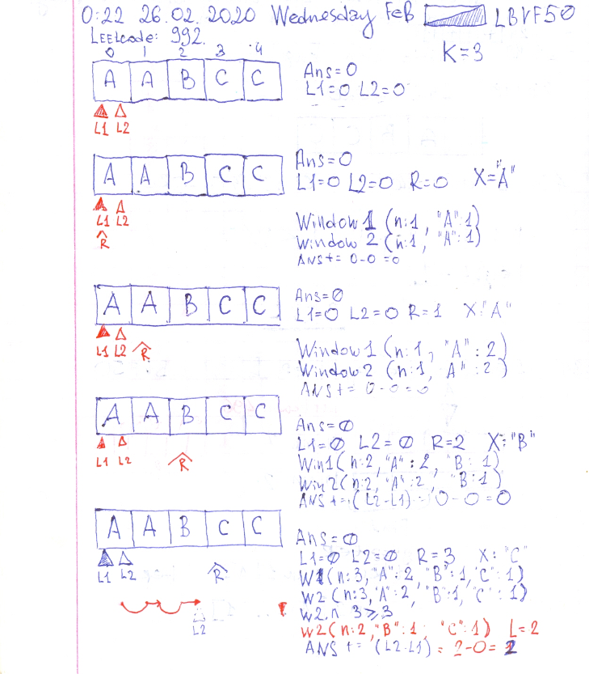
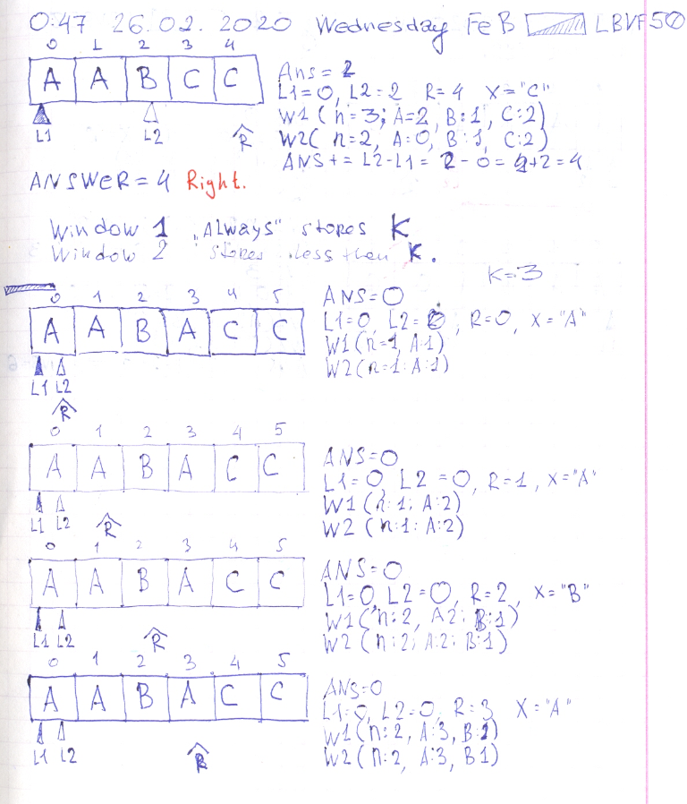
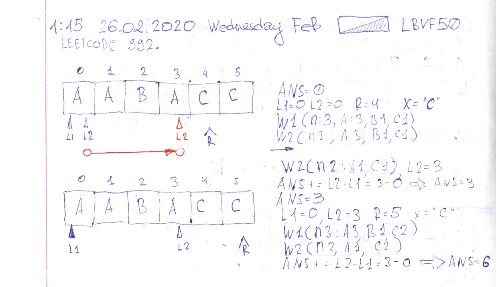

# Leetcode: 992 keep chasing the solution.

- https://leetcode.com/problems/subarrays-with-k-different-integers/
- https://gist.github.com/lbvf50mobile/02837a67f4635364a54a605815786a9f







```Ruby
# 992. Subarrays with K Different Integers
# https://leetcode.com/problems/subarrays-with-k-different-integers/
# Runtime: 208 ms, faster than 50.00% of Ruby online submissions for Subarrays with K Different Integers.
# Memory Usage: 17.6 MB, less than 100.00% of Ruby online submissions for Subarrays with K Different Integers.
# @param {Integer[]} a
# @param {Integer} k
# @return {Integer}
class Win
    attr_accessor :n
    def initialize(name)
        @hash = {}
        @n = 0
        @name = name
    end
    def add(x)
        @hash[x] ||= 0
        @hash[x] += 1
        @n += 1 if 1 == @hash[x]
    end
    def del(x)
        @hash[x] -= 1
        @n -= 1 if @hash[x] <= 0
    end
    def to_s()
        "(n#{@n},  #{@hash})"
    end
    
end
def subarrays_with_k_distinct(a, k)
    answer = 0
    l1,l2 = 0,0
    w1 = Win.new("w1")
    w2 = Win.new("w2")
    a.each_with_index do |x,r|
        
        w1.add(x)
        w2.add(x)
        
        # puts "l1 = #{l1}, l2 = #{l2}"
        # puts "w1  #{w1}"
        # puts "w2  #{w2}"
        
        while w1.n > k
            w1.del(a[l1])
            l1 += 1
        end
        while w2.n >= k
            w2.del(a[l2])
            l2 += 1
            # puts "- w2  #{w2}"
        end
        answer += (l2 - l1)
    end
   
    answer
end
```