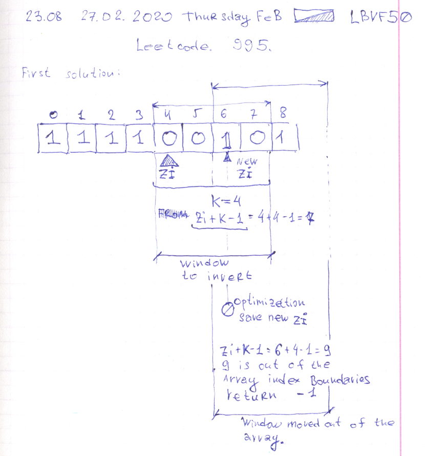

# Leetcode: 995. Minimum Number of K Consecutive Bit Flips. Day two. 501. Find Mode in Binary Search Tree.

- https://leetcode.com/problems/minimum-number-of-k-consecutive-bit-flips/
- https://gist.github.com/lbvf50mobile/e79a89291ac518c08eb8ff37249f606d




- https://leetcode.com/problems/find-mode-in-binary-search-tree/
- https://gist.github.com/lbvf50mobile/6e35069f14d9d4bafeab34b58f502ae4


```Ruby
# 501. Find Mode in Binary Search Tree
# https://leetcode.com/problems/find-mode-in-binary-search-tree/
# Runtime: 48 ms, faster than 100.00% of Ruby online submissions for Find Mode in Binary Search Tree.
# Memory Usage: 11.7 MB, less than 100.00% of Ruby online submissions for Find Mode in Binary Search Tree.
# Definition for a binary tree node.
# class TreeNode
#     attr_accessor :val, :left, :right
#     def initialize(val)
#         @val = val
#         @left, @right = nil, nil
#     end
# end

# @param {TreeNode} root
# @return {Integer[]}
def find_mode(root)
    return [] if root.nil?
    ans = {}
    save = ->x{ ans[x.val] ||=0 ; ans[x.val] += 1}
    queue = []
    queue.push root 
    save[root]
    while ! queue.empty?
        x = queue.shift
        if x.left
            l = x.left
            queue.push l
            save[l]
        end
        if x.right
            r = x.right
            queue.push r
            save[r]
        end
    end
    max = ans.values.max
    ans.to_a.select{|x| x[1] == max}.map(&:first)
end
```