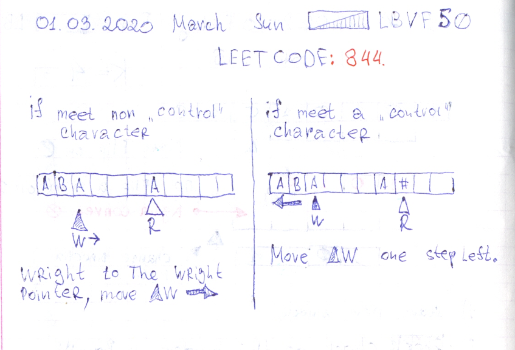

# Leetcode: 844 and 1074.

- https://leetcode.com/problems/backspace-string-compare/
- https://gist.github.com/lbvf50mobile/64756ca934f666242a48589e88cd014d
- https://leetcode.com/problems/backspace-string-compare/discuss/524253/Just-a-Ruby-solutuion-with-two-methods.
- https://leetcode.com/problems/backspace-string-compare/discuss/524464/O(1)-Space.-O(N)-time.

```Ruby
# 844. Backspace String Compare
# https://leetcode.com/problems/backspace-string-compare/
# Runtime: 36 ms, faster than 81.48% of Ruby online submissions for Backspace String Compare.
# Memory Usage: 9.2 MB, less than 100.00% of Ruby online submissions for Backspace String Compare.
# @param {String} s
# @param {String} t
# @return {Boolean}
def string_creator(s)
    s.chars.each_with_object([]) do |char,array|
        if '#' == char
            array.pop
        else
            array.push(char)
        end
    end.join
end
def backspace_compare(s, t)
    string_creator(s) == string_creator(t)
end
```

In place solution that requires `O(1)` **SPACE** and `O(N)` time. Use two pointers.  The `W` wright one, and `R` a read one.  If `R` pointer points on non command char write in on `W` place and move `R` one step right.  In case when `R` pointer points on command `#`, just move `R` pointer one step left. This allows to prepare string to comparison without allocating new memory or changing it's type.



```Ruby
# 844. Backspace String Compare
# https://leetcode.com/problems/backspace-string-compare/
# Runtime: 40 ms, faster than 33.33% of Ruby online submissions for Backspace String Compare.
# Memory Usage: 9.3 MB, less than 100.00% of Ruby online submissions for Backspace String Compare.
# @param {String} s
# @param {String} t
# @return {Boolean}

def backspace_compare(s, t)
    l_s = string_inline_creator(s)
    l_t = string_inline_creator(t)
    return false if l_s != l_t
    return true if -1 == l_s
    s[0..l_s] == t[0..l_t] 
end
def string_inline_creator(s)
    w = -1
    (0...s.size).each do |r|
        read = s[r]
        if "#" == read
            w -= 1 if w >= 0 
        else
            w += 1
            s[w] = read
        end
    end
    w
end
```