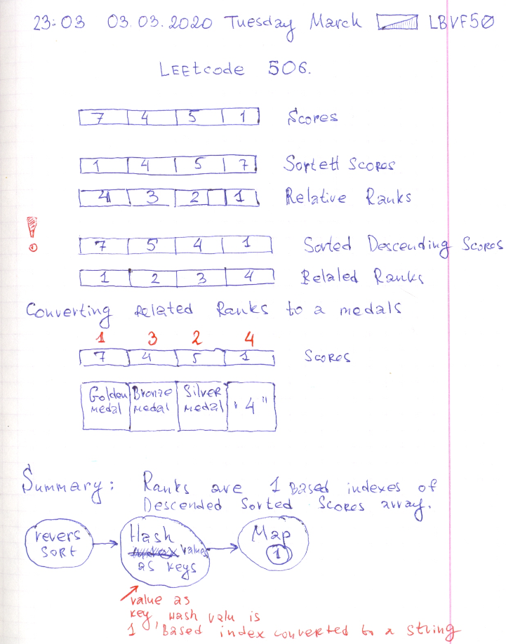

# Leetcode: 506. Relative Ranks. 

- https://leetcode.com/problems/relative-ranks/
- https://gist.github.com/lbvf50mobile/1f6827b9148f75c02bdb4eacc3d20c12

Relative ranks are 1 based indices of descending (reverse) sorted scores. The algorithm is



- Acquire reverse sorted nums array.
- Generate hash where keys are elements of reverse sorted array, values are 1 based indices converted to string.
- Map original array, substituting elements by values from the hash. 
- Substitute "1", "2" and "3" with a "Gold", "Silver", "Bronze" respectively.

```Ruby
# 506. Relative Ranks.
# https://leetcode.com/problems/relative-ranks/
# Runtime: 68 ms, faster than 100.00% of Ruby online submissions for Relative Ranks.
# Memory Usage: 11.2 MB, less than 100.00% of Ruby online submissions for Relative Ranks.
# @param {Integer[]} nums
# @return {String[]}
def find_relative_ranks(nums)
    hash = nums.sort_by{|x| -x}
    .each_with_index
    .with_object({}){|(value,index),object| object[value] = (index + 1).to_s}
    nums.map{|x| 
        case hash[x]
            when "1"
            "Gold Medal"
            when "2"
            "Silver Medal"
            when "3"
            "Bronze Medal"
        else
            hash[x]
        end
    }
    
end
```