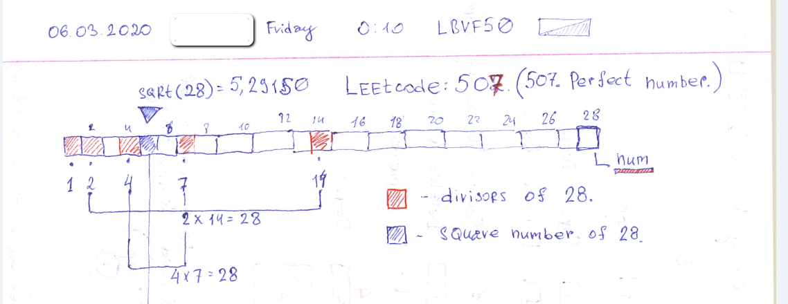

# Leetcode: 507. Perfect number.

- https://leetcode.com/problems/perfect-number/
- https://gist.github.com/lbvf50mobile/52b08b82034f52885d5fcc8fdf5420a3 

```Ruby
# 507. Perfect Number
# https://leetcode.com/problems/perfect-number/
# @param {Integer} num
# @return {Boolean}
require "prime"
def check_perfect_number(num)
    sum = 0
    (1...num).each do |i|
        sum += i if 0 == num%i
    end
    sum == num
end
```

The Trick is to find out that there are divisors from both sides of `sqrt(num)`. All except 1. 



```Ruby
# 507. Perfect Number
# https://leetcode.com/problems/perfect-number/
# Runtime: 40 ms, faster than 57.14% of Ruby online submissions for Perfect Number.
# Memory Usage: 9.3 MB, less than 100.00% of Ruby online submissions for Perfect Number
# @param {Integer} num
# @return {Boolean}
require "prime"
def check_perfect_number(num)
    return false if 1 == num
    sum = 1
    i = 2
    while i*i <= num
        sum += i + num/i if 0 == num%i
        i += 1
    end
    p sum
    sum == num
end
```