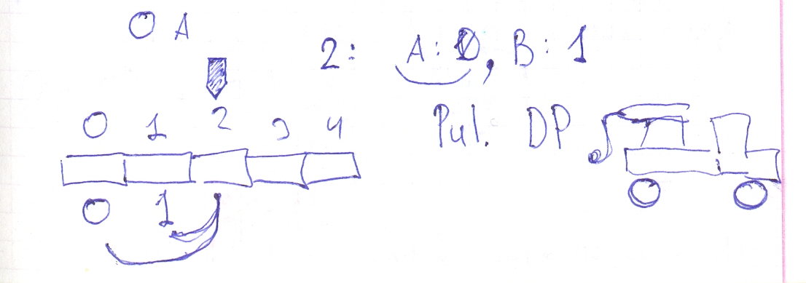

# Leetcode: 509. Fibonacci Number.

- https://leetcode.com/problems/fibonacci-number/
- https://gist.github.com/lbvf50mobile/772c0e840c3c1b288a1f660c9667ab65

This is a very special guest a Fibonacci Number a basic example for DP programming. This code is implemented by Pulling DP technique.



```Ruby
# 509. Fibonacci Number
# https://leetcode.com/problems/fibonacci-number/
# @param {Integer} n
# @return {Integer}
def fib(n)
    return 0 if n.zero?
    return 1 if 1 == n
    a = 0
    b = 1
    value = 0
    (2..n).each do |i|
        value = a + b
        a, b = b, value
    end
    value 
end
```