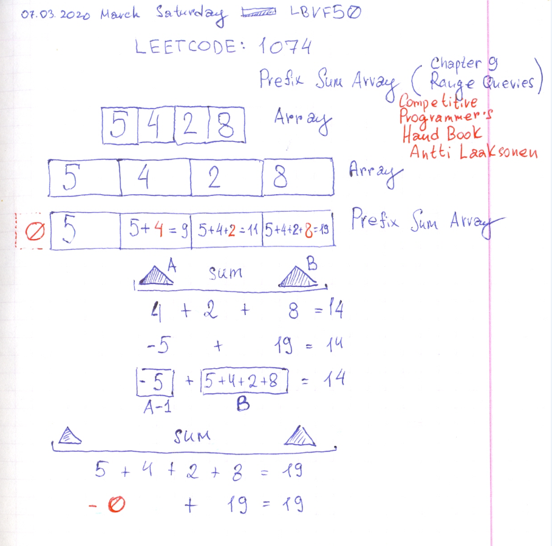

# Leetcode: 509. Fibonacci Number. Leetcode: 1074 work with Prefix sum.

- https://leetcode.com/problems/fibonacci-number/
- https://gist.github.com/lbvf50mobile/772c0e840c3c1b288a1f660c9667ab65

This is a very special guest a Fibonacci Number a basic example for DP programming. This code is implemented by Pulling DP technique.


```Ruby
# 509. Fibonacci Number
# https://leetcode.com/problems/fibonacci-number/
# @param {Integer} n
# @return {Integer}
def fib(n)
    return 0 if n.zero?
    return 1 if 1 == n
    a = 0
    b = 1
    value = 0
    (2..n).each do |i|
        value = a + b
        a, b = b, value
    end
    value 
end
```

- https://leetcode.com/problems/number-of-submatrices-that-sum-to-target/
- https://github.com/pllk/cphb/
- https://cses.fi/book/book.pdf
- Competitive Programmer's Handbook (c) Antii Laaksonen: Chapter 9: Range Queries. Prefix sum.
- https://gist.github.com/lbvf50mobile/abba39727c51b47ce5fb8e2f1cefe207



```Ruby
# Leetcode: 509. Fibonacci Number. Leetcode: 1074 work with Prefix sum.
# https://leetcode.com/problems/number-of-submatrices-that-sum-to-target/
require "minitest/autorun"

def prefix_sum(arr,a,b)
    prefix = [0] * arr.size
    prefix[0] = arr[0]
    (1...arr.size).each do |i|
        prefix[i] = arr[i] + prefix[i-1]
    end
    a_val = a > 0 ? prefix[a-1] : 0
    b_val = prefix[b]
    b_val - a_val
end

def sum(arr,a,b)
    arr[a..b].reduce(:+)
end

describe "prefix sum array" do
    it "works" do
        a = [1,2,3,4,5]
        assert_equal prefix_sum(a,1,4),sum(a,1,4)
        assert_equal prefix_sum(a,0,4),sum(a,0,4)
    end
    it "all_possible_ranges" do
        a = [1,2,3,4,5]
        (0...a.size).each do |i|
            (i...a.size).each do |j|
                assert_equal prefix_sum(a,i,j),sum(a,i,j)
                assert_equal prefix_sum(a,i,j),sum(a,i,j)
            end
        end
    end
end
```