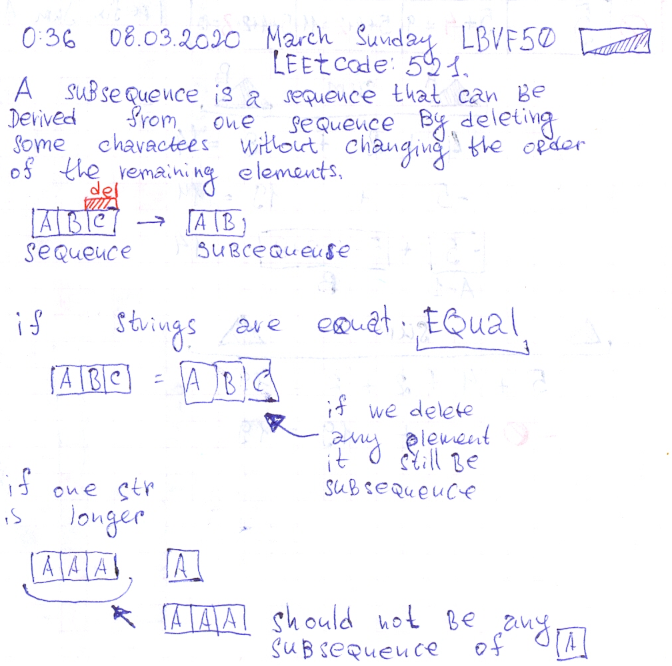

# Leetcode: 521. Longest Uncommon Subsequence I. And Leetcode: 1074.

- https://leetcode.com/problems/longest-uncommon-subsequence-i/
- https://gist.github.com/lbvf50mobile/3ab0a726e0b903b00d81948929e7caa3
- https://leetcode.com/problems/longest-uncommon-subsequence-i/discuss/532010/Explanation-with-drawings.-Ruby-100.

#### Leetcode: 521.

The key to understanding this task is that `AA` should not be any subsequence of the `A`.



```Ruby
# 521. Longest Uncommon Subsequence I
# https://leetcode.com/problems/longest-uncommon-subsequence-i/
# Runtime: 28 ms, faster than 100.00% of Ruby online submissions for Longest Uncommon Subsequence I .
# Memory Usage: 9.2 MB, less than 100.00% of Ruby online submissions for Longest Uncommon Subsequence I .
# @param {String} a
# @param {String} b
# @return {Integer}
def find_lu_slength(a, b)
    return a.size if a.size > b.size
    return -1 if a == b
    b.size
end
```

```Ruby
# 521. Longest Uncommon Subsequence I
# https://leetcode.com/problems/longest-uncommon-subsequence-i/
# @param {String} a
# @param {String} b
# @return {Integer}
def find_lu_slength(a, b)
    return -1 if a == b
    return [a.size,b.size].max
end
```