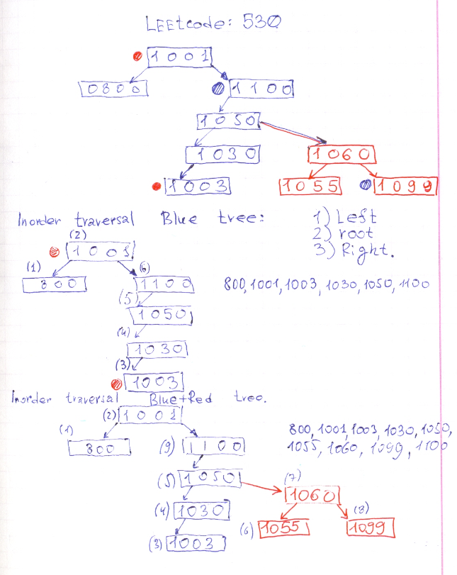

# Leetcode: 530 Minimum Absolute Difference in BST.

- https://leetcode.com/problems/minimum-absolute-difference-in-bst/
- https://www.geeksforgeeks.org/tree-traversals-inorder-preorder-and-postorder/
- https://gist.github.com/lbvf50mobile/57e03d632d7217fdecc2d75995bf0da8
- An in-order traversal of a binary search tree will always result in a sorted list of node items (numbers, strings or other comparable items). [wiki](https://en.wikipedia.org/wiki/Binary_search_tree#Traversal)
- https://leetcode.com/problems/minimum-absolute-difference-in-bst/discuss/534542/In-order-Traversal.-Ruby-100.



```Ruby
# 530. Minimum Absolute Difference in BST
# Runtime: 40 ms, faster than 100.00% of Ruby online submissions for Minimum Absolute Difference in BST.
# Memory Usage: 10.1 MB, less than 100.00% of Ruby online submissions for Minimum Absolute Difference in BST.
# https://leetcode.com/problems/minimum-absolute-difference-in-bst/submissions/

# Definition for a binary tree node.
# class TreeNode
#     attr_accessor :val, :left, :right
#     def initialize(val)
#         @val = val
#         @left, @right = nil, nil
#     end
# end

# @param {TreeNode} root
# @return {Integer}
def get_minimum_difference(root)
    @min = nil
    @prev = nil
    inorder(root)
    @min
end
def inorder(root)
    return if root.nil?
    inorder(root.left)
    if @prev
        v = root.val - @prev
        @min = v if @min.nil? || v < @min
    end
    @prev = root.val
    inorder(root.right)
end
```

```Ruby
# 530. Minimum Absolute Difference in BST
# https://leetcode.com/problems/minimum-absolute-difference-in-bst/submissions/
# Runtime: 1260 ms, faster than 25.00% of Ruby online submissions for Minimum Absolute Difference in BST.
# Memory Usage: 10 MB, less than 100.00% of Ruby online submissions for Minimum Absolute Difference in BST
# Definition for a binary tree node.
# class TreeNode
#     attr_accessor :val, :left, :right
#     def initialize(val)
#         @val = val
#         @left, @right = nil, nil
#     end
# end

# @param {TreeNode} root
# @return {Integer}
def get_minimum_difference(root)
    queue = [root]
    min = nil
    line = []
    
    while ! queue.empty?
        x = queue.shift
        line.push x.val
        line.sort!
        queue.push(x.left) if x.left
        queue.push(x.right) if x.right
    end
    
    min = line[1] - line[0]
    
    (2...line.size).each do |i|
        val = line[i] - line[i-1]
        min = val if val < min
    end
    min
    
end
```