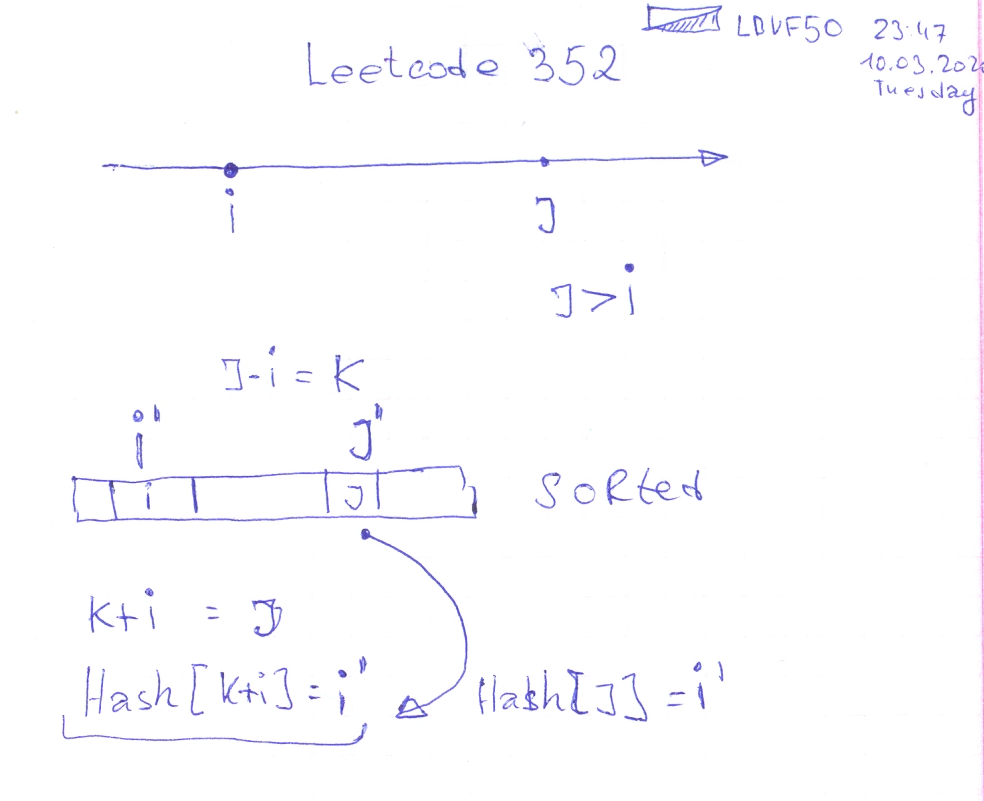

# Leetcode: 532. K-diff Pairs in an Array.

- https://leetcode.com/problems/k-diff-pairs-in-an-array/
- https://gist.github.com/lbvf50mobile/6d12785c331334da1444b81f29b2ae8d#file-find_pairs-rb-L14

```Ruby
# 532. K-diff Pairs in an Array
# https://leetcode.com/problems/k-diff-pairs-in-an-array/
# Runtime: 72 ms, faster than 36.84% of Ruby online submissions for K-diff Pairs in an Array.
# Memory Usage: 13 MB, less than 100.00% of Ruby online submissions for K-diff Pairs in an Array.
# @param {Integer[]} nums
# @param {Integer} k
# @return {Integer}
def find_pairs(nums, k)
    nums.sort!
    hash = {}
    ans = []
    nums.each_with_index do |x,i|
        key = x+k
        ans.push([x-k,x]) if hash[x]
        hash[key] = i
    end
    ans.uniq.size
end
```
Example shows why do we need sort.
```
[3,1,4,1,5]
2
```



```
# 532. K-diff Pairs in an Array
# https://leetcode.com/problems/k-diff-pairs-in-an-array/
# Runtime: 64 ms, faster than 57.89% of Ruby online submissions for K-diff Pairs in an Array.
# Memory Usage: 13.1 MB, less than 100.00% of Ruby online submissions for K-diff Pairs in an Array.
# @param {Integer[]} nums
# @param {Integer} k
# @return {Integer}
require "set"
def find_pairs(nums, k)
    nums.sort! 
    hash = {}
    hash1 = {}
    ans = Set.new
    nums.each_with_index do |x,i|
        key = x+k
        key1 = x-k
        ans.add([x-k,x]) if hash[x]
        ans.add([x, x+k]) if hash1[x]
        hash[key] = i
        hash1[key1] = i
    end
    ans.size
end
# Fail on this.
[1,2,3,4,5]
-1
```