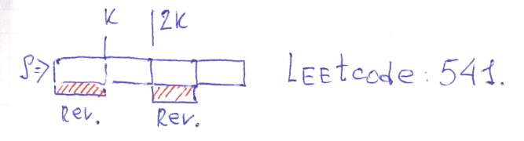

# Leetcode: 541. Reverse String II. (1074)

- https://leetcode.com/problems/reverse-string-ii/submissions/
- https://gist.github.com/lbvf50mobile/3d8e16326e9fb66ef4395d1de68ec6c8



```Ruby
# 541. Reverse String II
# https://leetcode.com/problems/reverse-string-ii/submissions/
# @param {String} s
# @param {Integer} k
# @return {String}
def reverse_str(s, k)
    arr = s.chars
    arr.each_slice(2*k)
    .map{|x|
        if x.size == 2*k
            x[0...k].reverse + x[k..-1]
        elsif x.size >= k
            x[0...k].reverse + x[k..-1]
        else
            x.reverse
        end
    }.flatten.join
    
end
```