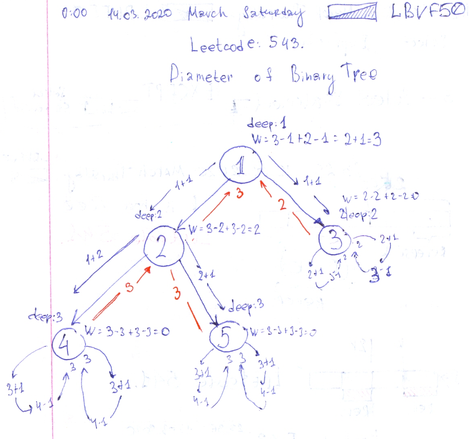
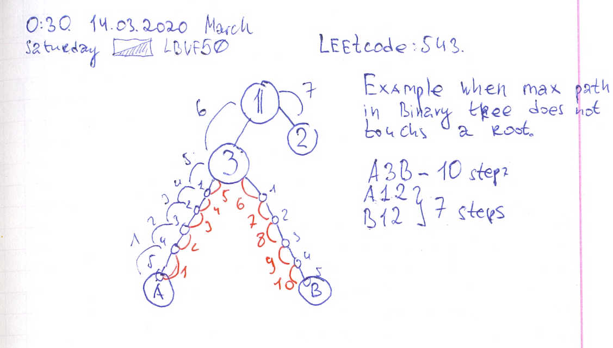

# 543. Diameter of Binary Tree.

- https://leetcode.com/problems/diameter-of-binary-tree/
- https://gist.github.com/lbvf50mobile/4196c7a5b7d17a038b7f8f0b43a10b4d

At the each recursion call find depth of each subtree. And eventually return the maximum depth from two of them. Also during recursion calculate number of edges between deepest leafs of both sub trees. The maximum number of edges between deepest leafs of sub trees will be the answer.



Example when longest pash does not touch a root. When left subtree have two similar length of left and right branches and sum of this lengths is bigger than sum with right subtree length. 



```Ruby
# 543. Diameter of Binary Tree
# https://leetcode.com/problems/diameter-of-binary-tree/submissions/
# Runtime: 40 ms, faster than 71.64% of Ruby online submissions for Diameter of Binary Tree.
# Memory Usage: 9.8 MB, less than 100.00% of Ruby online submissions for Diameter of Binary Tree.
# Definition for a binary tree node.
# class TreeNode
#     attr_accessor :val, :left, :right
#     def initialize(val)
#         @val = val
#         @left, @right = nil, nil
#     end
# end

# @param {TreeNode} root
# @return {Integer}
def diameter_of_binary_tree(root)
    @max_diff = 0
    dfs(root,1)
    @max_diff
end

def dfs(x,deep)
    return deep-1 if x.nil?
    l = dfs(x.left, deep+1)
    r = dfs(x.right, deep+1)
    w = (l-deep)+(r-deep)
    @max_diff = w if w > @max_diff
    value = l > r ? l : r
    return value
end
```