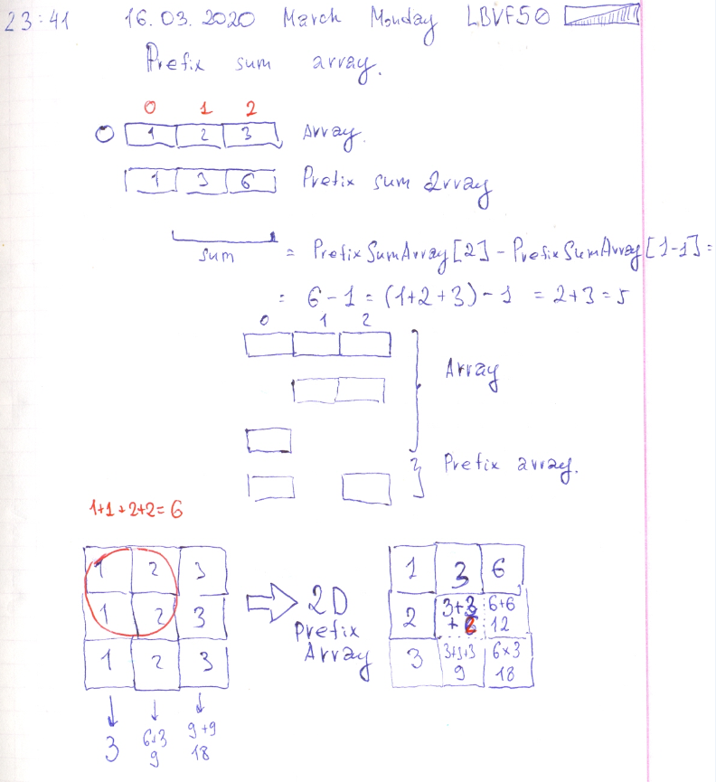

# Leetcode: 557. Reverse Words in a String III. And 2-d prefix sum.

- https://leetcode.com/problems/reverse-words-in-a-string-iii/
- https://gist.github.com/lbvf50mobile/42adfb0ae259e52de3b9dc8d38888894

```Ruby
# 557. Reverse Words in a String III
# https://leetcode.com/problems/reverse-words-in-a-string-iii/
# Runtime: 40 ms, faster than 70.59% of Ruby online submissions for Reverse Words in a String III.
# Memory Usage: 12.3 MB, less than 100.00% of Ruby online submissions for Reverse Words in a String III.
# @param {String} s
# @return {String}
def reverse_words(s)
    s.split(' ').map{|x| x.reverse}.join(' ')
    
end

```

In 2-d prefix sum, first calculated a value of cell for current row as like as for one dimensional  row. And than add value from the same colum in row above.

```
Array:
1, 2, 3;
1, 2, 3;
1, 2, 3;

Creating two dimensional Prefix array:

1,3,6;
1+1, (1+2) + 3, (1+2+3) + 6
1+1+1, (1+2) + 6, (1,2,3) + 12
```

