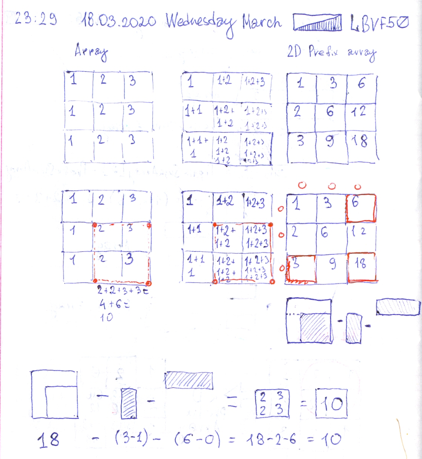

# Leetcode: 561. Array Partition I. (and 1074 2d prefix array)


- https://leetcode.com/problems/array-partition-i/
- https://gist.github.com/lbvf50mobile/88b40885e68d88cf59d346792ea0b892

```Ruby
# 561. Array Partition I
# https://leetcode.com/problems/array-partition-i/
# Runtime: 80 ms, faster than 71.43% of Ruby online submissions for Array Partition I.
# Memory Usage: 11.1 MB, less than 100.00% of Ruby online submissions for Array Partition I.
# @param {Integer[]} nums
# @return {Integer}
def array_pair_sum(nums)
  nums.sort.each_slice(2).sum{|(a,b)| a}  
end
```
### 2d prefix.

```
1 2 3
1 2 3
1 2 3

1 3 6
2 6 12
3 9 18

18 - (1+1) - (1+2+3) =
18 - (3-1) - (6-0) = 10
2+2+3+3 = 10
```
Bottom left square square will be equal: (total square) - (2 bottom elements of left column) - (top-row).


