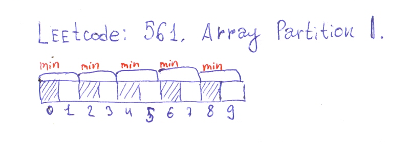

# Leetcode: 563. Binary Tree Tilt. (and 561)

- https://leetcode.com/problems/binary-tree-tilt/submissions/
- https://gist.github.com/lbvf50mobile/911ba6a0ce4d4fb32bdf0e222039955f
- https://leetcode.com/problems/binary-tree-tilt/discuss/544499/Explanation.-Ruby-100.

In this algorithm needs to calculate sub tree sum and subtree difference simultaneously. If calculating subtree sum is a classical recursive task, for calculating subtree difference additional data structure used. If it is a straightforward solution it could be a stack, and after DFS traversal of a tree need to sum values of the stack. Further in optimization stack could be substituted by a single variable. 


Straightforward: 

```Ruby
# 563. Binary Tree Tilt
# https://leetcode.com/problems/binary-tree-tilt/submissions/
# Runtime: 44 ms, faster than 50.00% of Ruby online submissions for Binary Tree Tilt.
# Memory Usage: 10.3 MB, less than 100.00% of Ruby online submissions for Binary Tree Tilt.
# Definition for a binary tree node.
# class TreeNode
#     attr_accessor :val, :left, :right
#     def initialize(val)
#         @val = val
#         @left, @right = nil, nil
#     end
# end

# @param {TreeNode} root
# @return {Integer}
def find_tilt(root)
    @tilts = []
    dfs(root)
    @tilts.sum
end
def dfs x
    if x.nil?
        @tilts.push 0
        return 0
    else
        left = dfs(x.left)
        right = dfs(x.right)
        tilt = (left - right).abs
        @tilts.push tilt
        return x.val + left + right
    end
end
```

Optimized:

```Ruby
# 563. Binary Tree Tilt
# https://leetcode.com/problems/binary-tree-tilt/submissions/
# Runtime: 36 ms, faster than 100.00% of Ruby online submissions for Binary Tree Tilt.
# Memory Usage: 10.1 MB, less than 100.00% of Ruby online submissions for Binary Tree Tilt.
# Definition for a binary tree node.
# class TreeNode
#     attr_accessor :val, :left, :right
#     def initialize(val)
#         @val = val
#         @left, @right = nil, nil
#     end
# end

# @param {TreeNode} root
# @return {Integer}
def find_tilt(root)
    @tilts = 0
    dfs(root)
    @tilts
end
def dfs x
    if x.nil?
        @tilts += 0
        return 0
    else
        left = dfs(x.left)
        right = dfs(x.right)
        tilt = (left - right).abs
        @tilts += tilt
        return x.val + left + right
    end
end
```
# Leetcode: 561. Array Partition I.

- https://leetcode.com/problems/array-partition-i/discuss/544536/Python-syntax-observation-several-solutons%3A-List-comprehension-Slice-notation-Range.

First need to sort an array, and then sum elements under even indices.



List comprehension:

```Python
'''
561. Array Partition I
https://leetcode.com/problems/array-partition-i/
Runtime: 300 ms, faster than 41.47% of Python3 online submissions for Array Partition I.
Memory Usage: 15.4 MB, less than 6.06% of Python3 online submissions for Array Partition I.
'''
class Solution:
    def arrayPairSum(self, nums: List[int]) -> int:
        return sum([value for index,value in enumerate(sorted(nums)) if 0 == index%2])
```

Python [slice notation](https://stackoverflow.com/a/509295/8574922):

```Python
'''
561. Array Partition I
https://leetcode.com/problems/array-partition-i/
Runtime: 292 ms, faster than 61.69% of Python3 online submissions for Array Partition I.
Memory Usage: 15.3 MB, less than 6.06% of Python3 online submissions for Array Partition I.
'''
class Solution:
    def arrayPairSum(self, nums: List[int]) -> int:
        return sum(sorted(nums)[::2])
```

[Range](https://docs.python.org/3/library/functions.html#func-range):

```Python
'''
561. Array Partition I
https://leetcode.com/problems/array-partition-i/
Runtime: 280 ms, faster than 92.06% of Python3 online submissions for Array Partition I.
Memory Usage: 15.4 MB, less than 6.06% of Python3 online submissions for Array Partition I.
'''
class Solution:
    def arrayPairSum(self, nums: List[int]) -> int:
        ans = 0
        nums = sorted(nums)
        for i in range(0,len(nums),2):
            ans += nums[i]
        return ans
```


