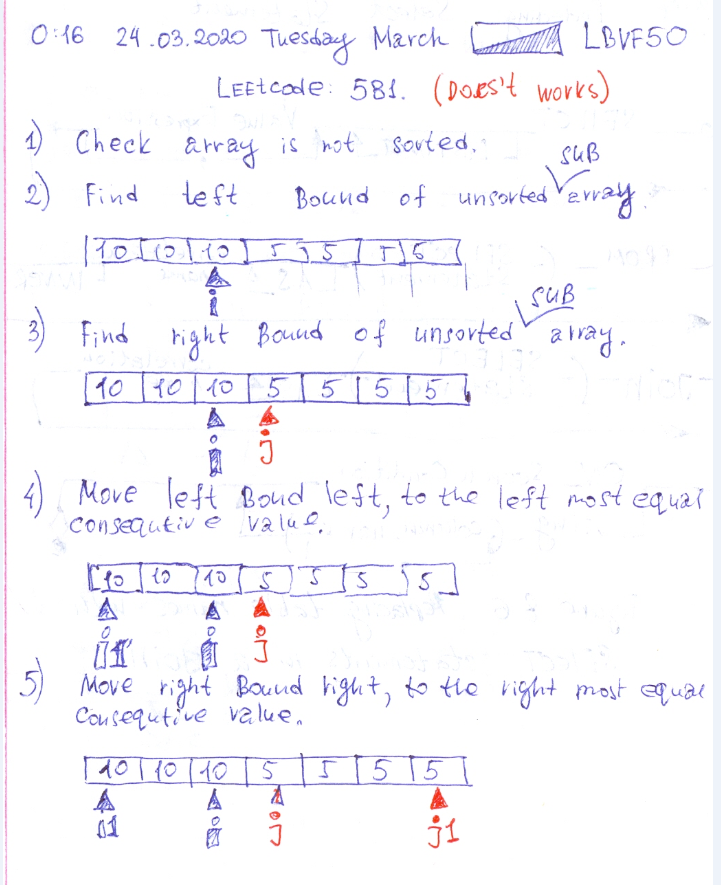
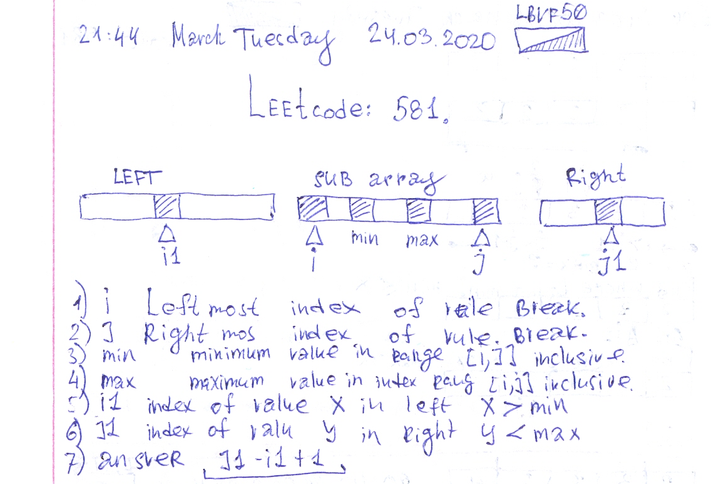

# Leetcode: 581. Shortest Unsorted Continuous Subarray.

- https://leetcode.com/problems/shortest-unsorted-continuous-subarray/
- https://gist.github.com/lbvf50mobile/7df57f3e5d56ef7cb01ee6cd70e510da

```Ruby
# 581. Shortest Unsorted Continuous Subarray (does not works)
# https://leetcode.com/problems/shortest-unsorted-continuous-subarray/
# @param {Integer[]} nums
# @return {Integer}
def find_unsorted_subarray(n)
    # Check array is not sorted.
    return 0 if n == n.sort
    # Find left bound of unsorted array.
    i = 0
    while i < n.size-1 && n[i] <= n[i+1]
        i += 1
    end
    # Find right bound of unsorted array.
    j = n.size - 1
    while j > 0 && n[j] >= n[j-1]
        j -= 1
    end
    p [i,j]
    # Move left bound left, to the left most equal consequtive value.
    i1 = i
    while i1 >= 0 && n[i] == n[i1]
        i1 -= 1
    end
    i1 += 1
   
    # More right bound right, to the right most equal consequtive value.
    j1 = j
    while j1 < n.size && n[j1] == n[j]
        j1 += 1
    end
    j1 -= 1
    
    # Return lengh of [i1,j1] interval
    p [i1,j1]
    p [n[i1],n[j1]]
    j1 - i1 + 1
end
```



### Sort and compare suffix and preffix.

Thanks @dizzy57.

```Ruby
# 581. Shortest Unsorted Continuous Subarray (does not works)
# https://leetcode.com/problems/shortest-unsorted-continuous-subarray/
# @param {Integer[]} nums
# @return {Integer}
def find_unsorted_subarray(n)
    s = n.sort
    return 0 if s == n
    left = 0
    while n[left] == s[left]
        left += 1
    end
    right = n.size - 1
    while n[right] == s[right]
        right -= 1
    end
    right - left + 1
end
```

### Some significant but wrong work.


`[2,6,4,6,10,9,15]` 
i = 1, j=5. min = 6, max = 9.  
- Select place for `min = 6` it will be `i1=1, a[i1]=6`  implementing `min <= x`. 
- Select place for `max=9` it will be `j1=5, a[j1]=9` implementing `max >= x`

Bounds of `[i1,j1]` gives sub array that need to be sorted from index `1` till index `5`, and it is smallest sub array.

`[1,3,2,2,2]`   
`i = 1`, `j = 2`, min = 2, max = 3.
- Select place for `min = 2` in will be `i1 = 1`, `a[i1] = 3` implementing `min <= x`   
- Select place for `max = 3` it will be `j1 = 4`, `a[j1] = 2` implementing `max >= x`

Interval `[i1,j1]` gives us sub array need to be sorted from index `1` till index `4`, and it is minimum subarray.

`[2,3,3,2,4]` 
`i = 2`, `j = 3`, min = 2, max = 3.  

- Select place for `min = 2` it will be `i1 = 0`, `a[i1] = 2` implementing `min <= x`
- Select place for `max = 3` it will be `j1 = 3`, `a[j1]= 2` implementing `max >= x`.

Interval `[i1, j1]` gives us array that need to be sorted from index `0` till index `3`. **But it is not smallest sub array**


### Works.



Fist I made an error. Seek for an indexes in the sub arrays index scopes.

```Ruby
# 581. Shortest Unsorted Continuous Subarray 
# [1,3,2,2,2]
# @param {Integer[]} nums
# @return {Integer}
def find_unsorted_subarray(n)
    # Nothing to sort.
    return 0 if 2 > n.size

    # i left most index of rule break.
    i = 0
    while i < n.size-1 && n[i] <= n[i+1]
        i += 1
    end
    puts "This is i=#{i} and it is #{n[i]}"
    
    # Array is sorted.
    return 0 if i == n.size-1
    
    # j right most index of rule break.
    j = n.size-1
    while j > 0 && n[j-1] <= n[j]
        j -= 1
    end
    puts "This is j=#{j} and it is #{n[j]}"
    puts "thsi is sub array #{n[i..j]}"
    min,max = n[i..j].minmax
    puts "This is min = #{min} and this is max=#{max}"
    
    i1 = nil
    (0...i).each do |tmp|
        if n[tmp] > min
            i1 = tmp
            break
        end
    end
    j1 = nil
    (j+1...n.size).reverse_each do |tmp|
        if n[tmp] < max
            j1 = tmp
            break
        end
    end
    
    
    i1 ||= i
    j1 ||= j
    
    puts "this is i1 = #{i1} and it is #{n[i1]}"
    puts "this is j1 = #{j1} and it is #{n[j1]}"
    j1 - i1 + 1
    
end
```


