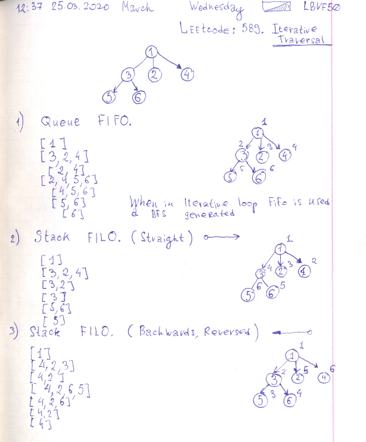

# Repeating Pythong slice notation. And Leetcode: 589. N-ary Tree Preorder Traversal.

- https://gist.github.com/lbvf50mobile/639a3e1c2d9a6838621b141156245492
- https://stackoverflow.com/a/509295/8574922

In Python both in range and slice right bound is exclusive.


```Python
# Python: Repeating Python slice notation.
# https://stackoverflow.com/a/509295/8574922

array = [x for x in range(0,11)]
print("Array from 0 to 10")
print(array)
print("Array array[1:10:3] will be [1,4,7]")
print(array[1:10:3])
```

- https://leetcode.com/problems/n-ary-tree-preorder-traversal/
- https://gist.github.com/lbvf50mobile/b3b0b1553c8f0654326623abb488a9bc

```Python
"""
589. N-ary Tree Preorder Traversal
https://leetcode.com/problems/n-ary-tree-preorder-traversal/
Runtime: 56 ms, faster than 23.86% of Python3 online submissions for N-ary Tree Preorder Traversal.
Memory Usage: 14.7 MB, less than 100.00% of Python3 online submissions for N-ary Tree Preorder Traversal.
# Definition for a Node.
class Node:
    def __init__(self, val=None, children=None):
        self.val = val
        self.children = children
"""
class Solution:
    def preorder(self, root: 'Node') -> List[int]:
        answer = []
        if not root: return answer
        stack = [root]
        while stack:
            x = stack.pop()
            answer.append(x.val)
            for i in range(len(x.children)-1, -1, -1):
                stack.append(x.children[i])
        return answer
            
```
Because first tow nodes are similar in queue and stack (with rotated order of descendants) this leads to confusion. But if observe more carefully even reversed order of adding descendants does not eliminate distinction in extracting elements from a data structure.


