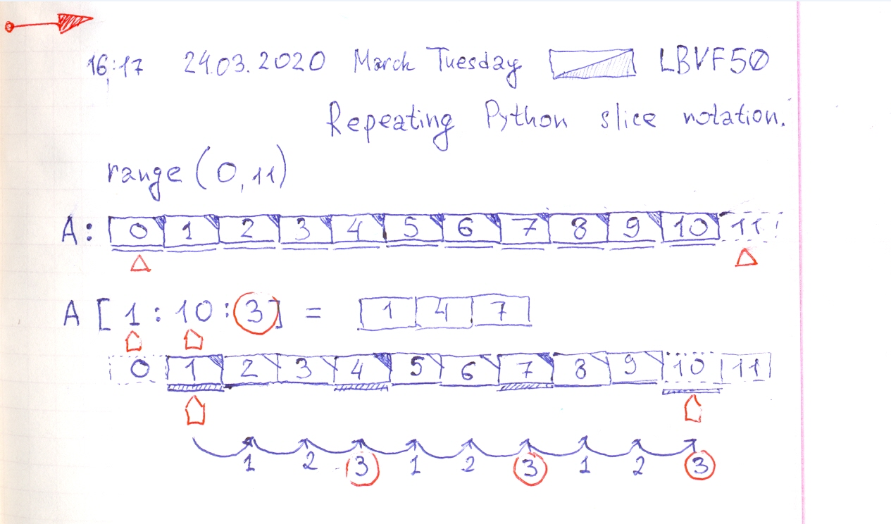

# Repeating Pythong slice notation.

- https://gist.github.com/lbvf50mobile/639a3e1c2d9a6838621b141156245492
- https://stackoverflow.com/a/509295/8574922

In Python both in range and slice right bound is exclusive.



```Python
# Python: Repeating Python slice notation.
# https://stackoverflow.com/a/509295/8574922

array = [x for x in range(0,11)]
print("Array from 0 to 10")
print(array)
print("Array array[1:10:3] will be [1,4,7]")
print(array[1:10:3])
```