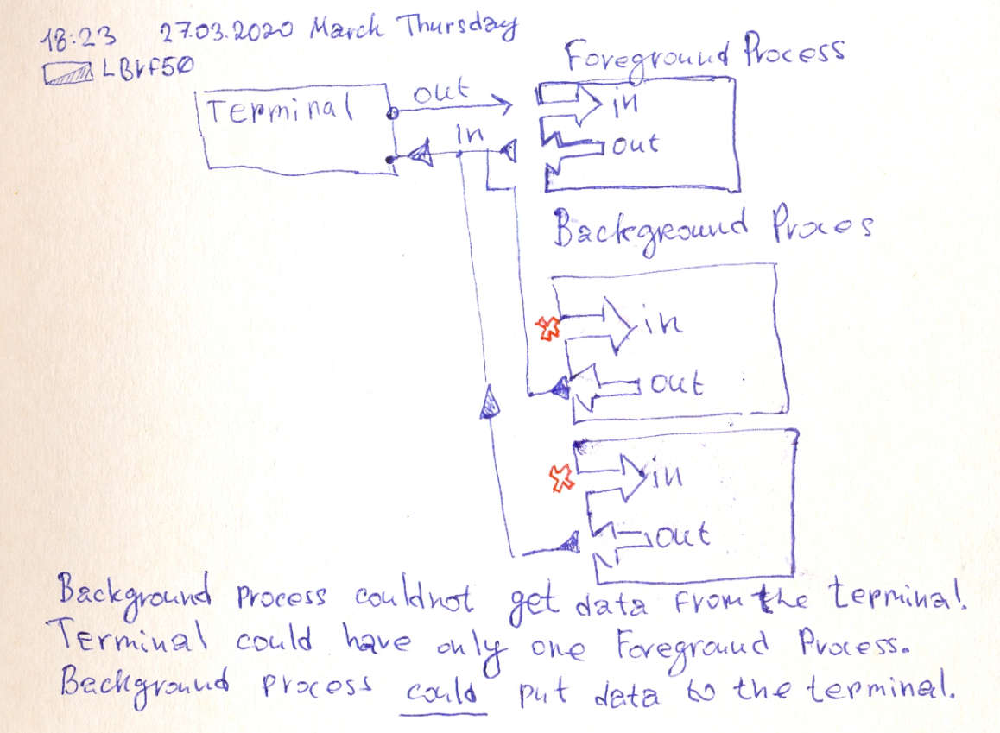

# Background and Foreground processes.

- Background process could not get data from the terminal.
- Each terminal have only one foreground process.
- Background process **could** put data to the terminal. But this actions lead to mess.

