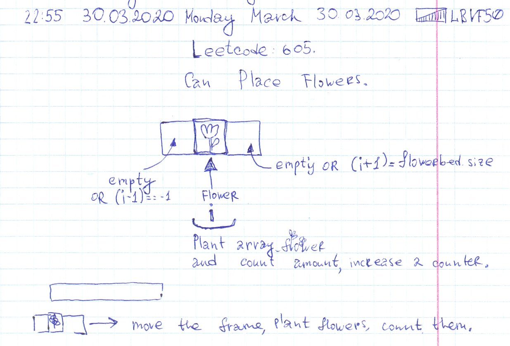

# Leetcode: 605. Can Place Flowers.

- https://leetcode.com/problems/can-place-flowers/
- https://gist.github.com/lbvf50mobile/91a3b0c806fcf1f574061fa14b4132dd
- https://leetcode.com/problems/can-place-flowers/discuss/556925/Ruby.-O(n).-Explanation.


Easy description.

It is possible to plant a new flower on place indexed `i` if `i+1` and `i-1` are empty. If such place found need to increment a counter of planted flowers and plant a flower for a future iteration. A flower is planted to remember that this place had been already used. 



```Ruby
# 605. Can Place Flowers
# https://leetcode.com/problems/can-place-flowers/
# Runtime: 40 ms, faster than 100.00% of Ruby online submissions for Can Place Flowers.
# Memory Usage: 10.6 MB, less than 100.00% of Ruby online submissions for Can Place Flowers.
# @param {Integer[]} flowerbed
# @param {Integer} n
# @return {Boolean}
def can_place_flowers(flowerbed, n)
    planted = 0
    (0...flowerbed.size).each do |i|
        one =  i-1 == -1 || 0 == flowerbed[i-1]
        two =  i+1 == flowerbed.size || 0 == flowerbed[i+1]
        if one && two
            planted += 1 if 0 == flowerbed[i]
            return true if planted >= n
            flowerbed[i] = 1
        end
    end
    planted >= n
end
```