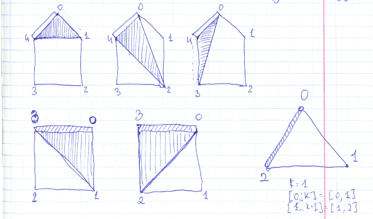

# Leetcode: 1039. Minimum Score Triangulation Polygon.

- https://leetcode.com/problems/minimum-score-triangulation-of-polygon/
- https://gist.github.com/lbvf50mobile/1bad45be5c8aad1085c8954127dec4bc#file-min_score_triangulation-rb-L7
- https://leetcode.com/problems/minimum-score-triangulation-of-polygon/discuss/571156/Ruby-100.-Explanation.-Image.


This task is solved as an recursive function, it this function there a loop with N-2 iteration for a polygon. During each iteration we calculate sum of triangles and select minimum one.
How does it achieved.  The edge is selected based on two vertexes last and first one. And N-2 triangles a build in number of vertexes that left. This is how each polygon split in to 3 sub polygons. Polygon before, the triangle, and polygon after. Minimum sum for each of this polygons could be calculated as a recursive call.

This is a recursive function. To calculate a minimum split into triangle pices we select one **edge** between to vertex (let it be an edge between first and last vertex). And draw all possible triangles with this **edge**. It will be **N-2** triangles, because there are **N-2** vertexes beside first and last one.  In this funcion we split the poigon in three sub poligons: **prev poligon**, triange that used this edge, and **future poligion**. 
For eaxmple if we have 5 vertexes with indices 0, 1, 2, 3, 4, it's could be **prev poligon: [0,1,2]**,  **triange: [0,2,4]**, **future poligion: [2,3,4]**. Each of this poligons could be send in recursive call, or calculated inplace if it has 3 sides.




```Ruby
# 1039. Minimum Score Triangulation of Polygon
# https://leetcode.com/problems/minimum-score-triangulation-of-polygon/
# Runtime: 84 ms, faster than 100.00% of Ruby online submissions for Minimum Score Triangulation of Polygon.
# Memory Usage: 9.5 MB, less than 100.00% of Ruby online submissions for Minimum Score Triangulation of Polygon.
# @param {Integer[]} a
# @return {Integer}
def min_score_triangulation(a)
    @h = Array.new(a.size).map{Array.new(a.size)}
    @a = a
    rec(0,a.size-1)
    
end

def rec(first,last)
    size = last - first + 1
    return 0 if 3 > size
    return @a[first+0]*@a[first+1]*@a[first+2] if 3 == size
    return @h[first][last] if @h[first][last]
    min = 1_000_000
    finish = last
    (first+1...finish).each do |k|
        prev_val = rec(first,k)
        cur_val = @a[first] * @a[k] * @a[finish]
        future_val = rec(k,finish)
        total = prev_val+cur_val+future_val
        min = total if total < min
    end
    @h[first][last] = min
    return min

```