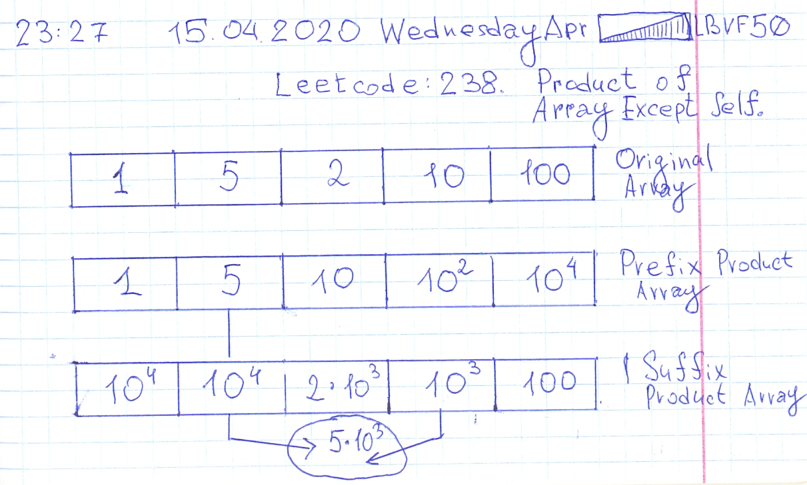

# Leetcode: 238. Product of array Except self.

- https://leetcode.com/problems/product-of-array-except-self/
- https://gist.github.com/lbvf50mobile/4e3d5a2b3c279b6629c942ad8d2ccd93
- https://leetcode.com/problems/product-of-array-except-self/discuss/581144/Ruby.-Prefix-and-Suffix-arrays-explanation.

Create prefix and suffix product array. Prefix product array it when `prefix[i] = nums[i] * nums[i-1]` and suffix it when moving from back to start `suffix[i] = suffix[i] * sufix[i+1]`. Thus multiplication of all elements except element with index `i` is `prefix[i-1] * suffix[i+1]`.



```Ruby
# 238. Product of Array Except Self
# https://leetcode.com/problems/product-of-array-except-self/
# Runtime: 72 ms, faster than 17.32% of Ruby online submissions for Product of Array Except Self.
# Memory Usage: 14 MB, less than 100.00% of Ruby online submissions for Product of Array Except Self.
# @param {Integer[]} nums
# @return {Integer[]}
def product_except_self(nums)
    ans = []
    size = nums.size
    prefix = nums.clone
    (1...size).each{|i| prefix[i] *= prefix[i-1]}
    suffix = nums.clone
    (0...size-1).reverse_each{|i| suffix[i] *= suffix[i+1]}
    (0...size).each{|i|
        left, right = 1,1
        left = prefix[i-1] if i > 0
        right = suffix[i+1] if i < size - 1
        ans.push(left*right)
    }
    ans
end
```