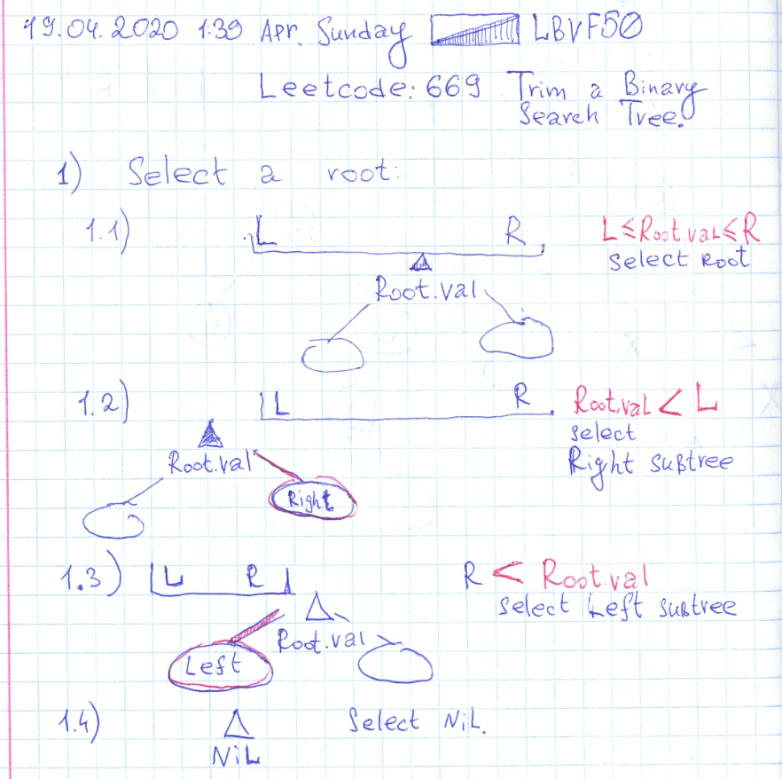

# Leetcode: 669. Trim a Binary Search Tree.  

- https://leetcode.com/problems/trim-a-binary-search-tree/
- https://gist.github.com/lbvf50mobile/8f722dd223f80c02a796ba0d31c13786
- https://leetcode.com/problems/trim-a-binary-search-tree/discuss/585962/Ruby.-Recursive-Solution.-Explanation.

This is a recursive task. Where need to select Root for a tree. And when a root is selected, call the method for left and right sub trees.

Selecting a Root is a recursive task itself too. There are four cases.

1. Root value is between L and R. Select current root.
2. Root value is less then L. Call selection of Right sub tree.
3. R is less than Root value. Call selection on Left sub tree.
4. Root node is nil. Return nil.



```Ruby
# 669. Trim a Binary Search Tree
# https://leetcode.com/problems/trim-a-binary-search-tree/
# Runtime: 48 ms, faster than 42.86% of Ruby online submissions for Trim a Binary Search Tree.
# Memory Usage: 10 MB, less than 100.00% of Ruby online submissions for Trim a Binary Search Tree.
# Definition for a binary tree node.
# class TreeNode
#     attr_accessor :val, :left, :right
#     def initialize(val)
#         @val = val
#         @left, @right = nil, nil
#     end
# end

# @param {TreeNode} root
# @param {Integer} l
# @param {Integer} r
# @return {TreeNode}
def trim_bst(root, l, r)
    # p "input: #{root ? root.val : 'nil'}"
    root = find_root(root, l, r)
    # p "set: #{root ? root.val : 'nil'}"
    if root
        root.left = trim_bst(root.left, l, r)
        root.right = trim_bst(root.right, l, r)
    end
    root
end
def find_root(root,l,r)
    return root if root.nil?
    return root if root.val.between?(l,r)
    return find_root(root.right,l,r) if root.val < l
    return find_root(root.left,l,r) if r < root.val
end
```