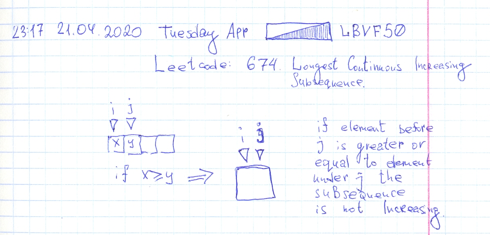

# Leetcode: 674. Longest Continuous Increasing Subsequence.

- https://leetcode.com/problems/longest-continuous-increasing-subsequence/
- https://gist.github.com/lbvf50mobile/545d3d5ba6cf44e27c060045ebe97f3a
- https://leetcode.com/problems/longest-continuous-increasing-subsequence/discuss/590810/Ruby.-Sliding-window.-Explanation.

This is a sliding window task, need to support interval between two indices where the property is valid. In this case, elements in the interval must be in strict increasing sequence. And by definition of this task, sequence from one element is in strict increasing order too. So first array of 0 elements has 0 length of max increasing sequence. Array of 1 element always have 1 increasing sequence size. These to conditions could be placed in the beginning of the method.

Further. Need to iterate through indexes of array starting from 1. This will be the end of interval. And one variable going to store beginning of the interval.  If last element of interval is greater or equal to the end of interval need to place start pointer at the same place as end pointer. And also in each iteration check for maximum length. That initially set to 1.



That's all.

```Ruby
# 674. Longest Continuous Increasing Subsequence.
# https://leetcode.com/problems/longest-continuous-increasing-subsequence/
# Runtime: 40 ms, faster than 52.54% of Ruby online submissions for Longest Continuous Increasing Subsequence.
# Memory Usage: 9.9 MB, less than 100.00% of Ruby online submissions for Longest Continuous Increasing Subsequence.
# @param {Integer[]} nums
# @return {Integer}
def find_length_of_lcis(nums)
    return 0 if nums.empty?
    return 1 if 1 == nums.size
    ans = 1
    i = 0
    (1...nums.size).each do |j|
        if nums[j] <= nums[j-1]
            i = j
        end
        size = j-i + 1
        ans = size if size > ans
    end
    ans
end
```