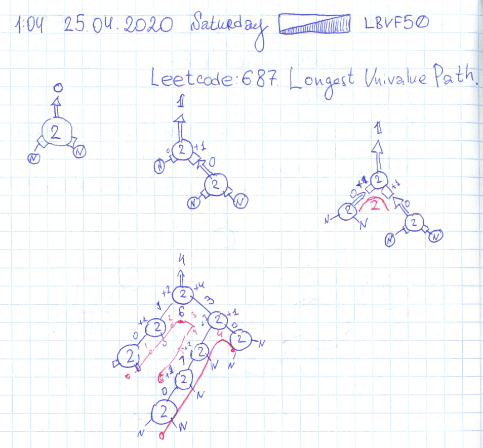

# Leetcode: 687. Longest Univalue Path.

- https://leetcode.com/problems/longest-univalue-path/
- https://gist.github.com/lbvf50mobile/356136062f123eefbcf1751f8fb7d596
- https://leetcode.com/problems/longest-univalue-path/discuss/595522/Ruby.-100.-DFS-drawing.

This task based on pure recursion. Recursive function in this task combine two actions passing data up to the caller, and calculate value for itself. Here need to calculate path between most distant points of left and right sub tree, where this node is in chain. And pass upward to the caller maximum
chain size selecting between left and right ones.

Each method passed upward the maximum size of chain with elements with value equal to it's value. So inside the method we check do the left child has the same value, to the right child have the same value. And depending on these information make decision how to generate data for return.

And also inside the method calculated value of chain that goes through this element, and this chain size compared and save as max value for return.

If the child value is equal to the current value, need add 1 to the child functions return. Because if child is last in chain - 0 will be return. And there is on edge between current node and child.  And this rule equal for left and right child.  To get the path that includes this node, need to add both function returns with adding 1 to each of them. 

For example node have left and right child with equal values, and there only 3 elements in tree. So the number of edges will be 2: (0+1) + (0+1).



```Ruby
# 687. Longest Univalue Path
# https://leetcode.com/problems/longest-univalue-path/
# Runtime: 176 ms, faster than 100.00% of Ruby online submissions for Longest Univalue Path.
# Memory Usage: 10.3 MB, less than 100.00% of Ruby online submissions for Longest Univalue Path.
# Definition for a binary tree node.
# class TreeNode
#     attr_accessor :val, :left, :right
#     def initialize(val)
#         @val = val
#         @left, @right = nil, nil
#     end
# end

# @param {TreeNode} root
# @return {Integer}
def longest_univalue_path(root)
    @max = 0 
    get_path(root)
    @max
end

def get_path(x)
    return 0 if x.nil?
    l = get_path(x.left)
    r = get_path(x.right)
    r_used = 0
    l_used = 0
    
    if x.left && x.left.val == x.val
        # puts "this is #{x.val}, and #{x.left.val} LEFT"
        l_used = l + 1
    end
    if x.right && x.right.val == x.val
        # puts "this is #{x.val}, and #{x.right.val} Right"
        r_used = r + 1
    end
    
    @max = l_used + r_used if l_used + r_used > @max
    [r_used,l_used].max
end
```