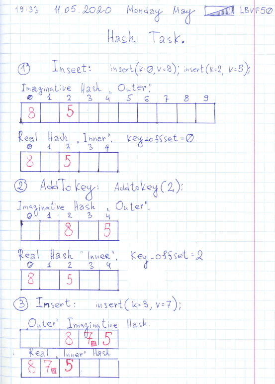

# Leetcode: 744. Find Smallest Letter Greater than target. And HashMap with keys increasing.

- https://leetcode.com/problems/find-smallest-letter-greater-than-target/
- https://gist.github.com/lbvf50mobile/0d28c334be80548c13e947e3e1ae24aa
- https://leetcode.com/problems/find-smallest-letter-greater-than-target/discuss/626722/Ruby-solution.
- Codesignal.com, Codewars.com
    - [tests](https://gist.github.com/lbvf50mobile/2da4d365fc3ed3f92ac91ac05f498118)
        - 
        - If hash has only integer keys, and need to increase all keys it's possible use encapsulated hash ans access elements by `h[key - key_offset]`. Were store offset. For example to elements in hash `{0:8,2:5}` increase all keys on tow `{2:8, 4:5}`. To access to elements without changing places in hash its possible to `h[key - 2] => h[2-2] => h[0] = 8`. And the same with adding for example need to add element with `key = 3`.  `h[key - 2] => h[3-2] => h[1]` just between `0 key` and `1 key` in original hash.
    - [Codewars: Find area of rectangle](https://gist.github.com/lbvf50mobile/1f2b0af48b44bf7128d56e6f5f10e0e2)
    - [Codesignal: Compose Ranges](https://gist.github.com/lbvf50mobile/3c96349a1a7ac006467640b8a61e2c9b)

***Ruby solutions.**  

```Ruby
=begin
Leetcode: 744. Find Smallest Letter Greater Than Target.
https://leetcode.com/problems/find-smallest-letter-greater-than-target/
Runtime: 52 ms, faster than 35.71% of Ruby online submissions for Find Smallest Letter Greater Than Target.
Memory Usage: 10.4 MB, less than 100.00% of Ruby online submissions for Find Smallest Letter Greater Than Target.
=end
# @param {Character[]} letters
# @param {Character} target
# @return {Character}
def next_greatest_letter(letters, target)
    answer = letters.select{|x| x > target}.min
    answer ? answer : letters.min
end
```

But the array is sorted, and no need to search for a min if there is not elements greater than target. It's possible to take first element of the input array in this case.

```Ruby
=begin
Leetcode: 744. Find Smallest Letter Greater Than Target.
https://leetcode.com/problems/find-smallest-letter-greater-than-target/submissions/
Runtime: 48 ms, faster than 50.00% of Ruby online submissions for Find Smallest Letter Greater Than Target.
Memory Usage: 10.3 MB, less than 100.00% of Ruby online submissions for Find Smallest Letter Greater Than Target.
=end
# @param {Character[]} letters
# @param {Character} target
# @return {Character}
def next_greatest_letter(letters, target)
    ans = letters.select{|x| x > target}.min
    ans ? ans : letters[0]
end
```

And do `min` method is really necessary in this case? Array already sorted it's possible to select first element bigger than target. No need to iterate over all array to detect precisely the minimum of this array. 

```Ruby
=begin
Leetcode: 744. Find Smallest Letter Greater Than Target.
https://leetcode.com/problems/find-smallest-letter-greater-than-target/submissions/
Runtime: 44 ms, faster than 85.71% of Ruby online submissions for Find Smallest Letter Greater Than Target.
Memory Usage: 10.3 MB, less than 100.00% of Ruby online submissions for Find Smallest Letter Greater Than Target.
=end
# @param {Character[]} letters
# @param {Character} target
# @return {Character}
def next_greatest_letter(letters, target)
    letters.each{|x| return x if x > target}
    letters[0]
end
```

=begin
Leetcode: 744. Find Smallest Letter Greater Than Target.
https://leetcode.com/problems/find-smallest-letter-greater-than-target/
Runtime: 52 ms, faster than 35.71% of Ruby online submissions for Find Smallest Letter Greater Than Target.
Memory Usage: 10.3 MB, less than 100.00% of Ruby online submissions for Find Smallest Letter Greater Than Target
=end
# @param {Character[]} letters
# @param {Character} target
# @return {Character}
def (letters, target)
    answer = nil
    letters.each do |char|
        if char > target
            answer = char if answer.nil? || answer > char
        end
    end
    answer ? answer : letters.min
end
```

More sophisticated solution. Because the input array has at least to 2 different characters it is defined that the answer always exists. In this solution created the position array two alphabets width. During first iteration over the input array places for matched characters filled. Each matched characters marked in two places in it's own ordinal number zero based, and ordinal number + 26. And after the pos array is filed. Start iteration from position right after target ordinal number. Thus if there is no characters greater than target in the input array, first smallest character will be met in the second part of the array. Further with modulo operation restored code of this character, and code transferred to a one element string.

Interesting that Solution with least amount of steps, works longer than solution that has two times more steps, but used optimized code from libraries.

```Ruby
=begin
Leetcode: 744. Find Smallest Letter Greater Than Target.
Runtime: 68 ms, faster than 14.29% of Ruby online submissions for Find Smallest Letter Greater Than Target.
Memory Usage: 10.4 MB, less than 100.00% of Ruby online submissions for Find Smallest Letter Greater Than Target.
=end
# @param {Character[]} letters
# @param {Character} target
# @return {Character}
def next_greatest_letter(letters, target)
    pos = Array.new(26)
    letters.each do |char|
        pos[char.ord - ?a.ord] = true
        pos[26 + char.ord - ?a.ord] = true
    end
    (target.ord - ?a.ord + 1 ... 52).each do |i|
       return (?a.ord + i%26).chr if pos[i]
    end
    raise "This could not happens."
end
```