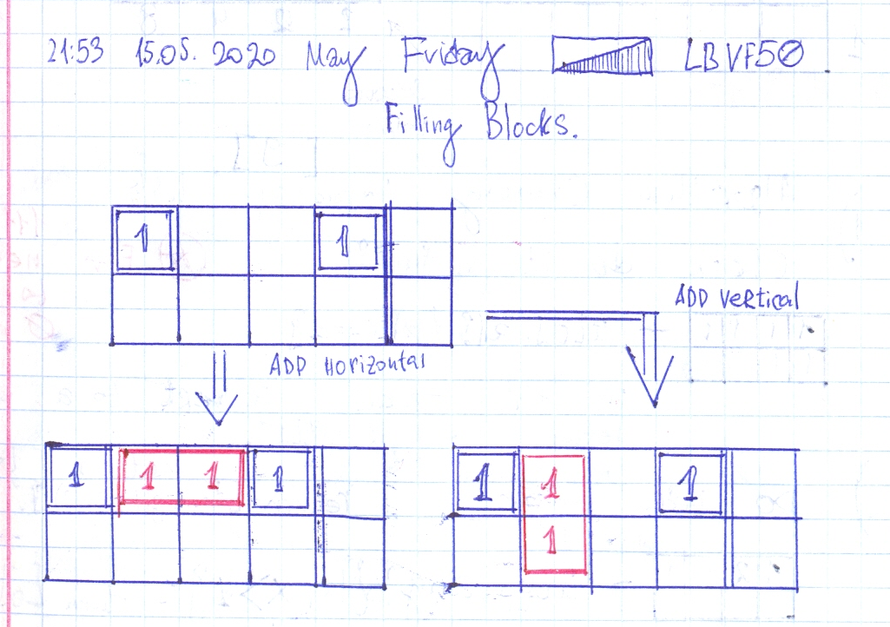
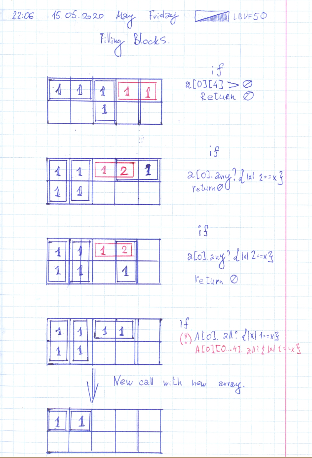

# Leetcode: 766. Toeplitz Matrix.

- https://leetcode.com/problems/toeplitz-matrix/
- https://gist.github.com/lbvf50mobile/ceca2e2219ee61eb1948db7212c48186#file-recursion-rb-L1
- https://leetcode.com/problems/toeplitz-matrix/discuss/633659/Ruby-recursion.

Each top row without last element is equal to the beneath row without first element.
And top row without to last element is equal to the row under beneath without two elements.
and so on. This way a recursive function could be written.  Get row, check to rows beneath 
meet the requirements. Call recursive function for matrix without top row.

If the rule violater return false, if all rows and matrixes meet the rules, when time comes to empty matrix return true.
And this true will climb up the the stack of calls.

Ruby code:

```Ruby
=begin
Leetcode: 766. Toeplitz Matrix.
https://leetcode.com/problems/toeplitz-matrix/
Runtime: 32 ms, faster than 100.00% of Ruby online submissions for Toeplitz Matrix.
Memory Usage: 9.9 MB, less than 100.00% of Ruby online submissions for Toeplitz Matrix.
=end
# @param {Integer[][]} matrix
# @return {Boolean}
def is_toeplitz_matrix(matrix)
    return true if matrix.empty?
    x = matrix
    top = x.shift
    top.pop
    i = 0
    while (!top.empty?) && (!x.empty?) &&  i < x[0].size && i < x.size
        a = x[i][i+1..-1]
        return false if a != top
        i += 1
        top.pop
    end
    return is_toeplitz_matrix(x)   
end
```

# Codesignal.com: Filling Blocks.

Recursion DP. Subtask defined by two rows array and index of first row.





Ruby code: 
```Ruby
# fillingBlocks https://app.codesignal.com/interview-practice/task/yWF4MmhvtmzfKNWgt

def fillingBlocks(n)
    @n = n
    @dp = {}
    array = Array.new(2).map{ Array.new(5,0)}
    rec(array,0)
end

def rec(array, index)
    filled = [1,1,1,1,0]
    if @n - 1 == index && array[0] == filled && array[1].all?{|x| 0 == x}
        return 1 
    end
    return 0 if @n == index
    if 1 == array[0][4]
        return 0
    end
    return 0 if array[0].any?{|x| x > 1}
    if array[0] == filled
        new_array = [array[1].clone, Array.new(5,0)]
        return rec(new_array,index+1)
    end
    key = array.flatten + [index]
    return @dp[key] if @dp[key]
    first_zero = array[0].index(0)
    horizontal = [array[0].clone, array[1].clone]
    vertical = [array[0].clone, array[1].clone]
    horizontal[0][first_zero] += 1
    horizontal[0][first_zero+1] += 1
    vertical[0][first_zero] += 1
    vertical[1][first_zero] += 1
    ans = rec(horizontal, index) + rec(vertical, index)
    @dp[key] = ans
    ans
end
p fillingBlocks(1)
p fillingBlocks(2)
p fillingBlocks(3) # 11
p fillingBlocks(4) 
p fillingBlocks(5) # 95 
p [fillingBlocks(1) == 1,fillingBlocks(2) == 5,fillingBlocks(3) == 11,fillingBlocks(4) == 36, fillingBlocks(5) == 95 ].all?
```