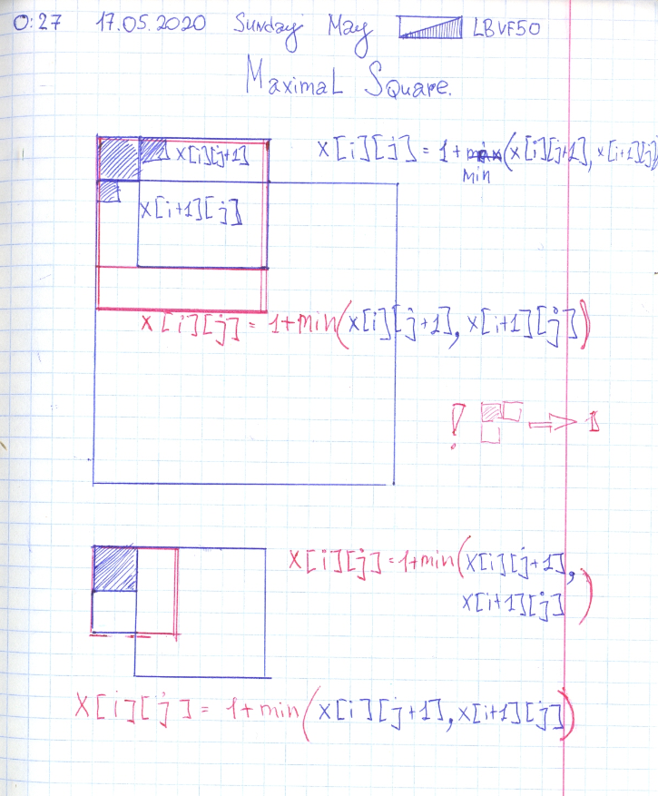
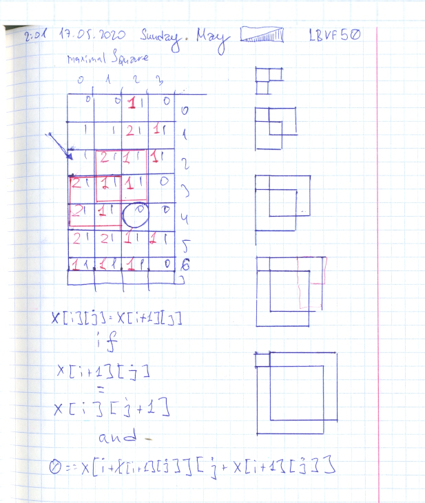
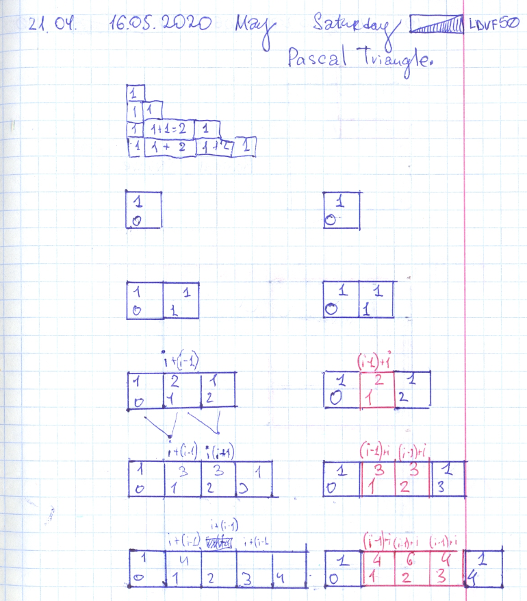

# Codesingal: Maximal Square. Leetcode: 1351. Count Negative Numbers in a Sorted Matrix.

- https://app.codesignal.com/interview-practice/task/mkobsYSSQo3JpvYNN/solutions
- https://gist.github.com/lbvf50mobile/151e249e900478cc607ce38f294fd108

Input:
matrix:

```
[["0","0","1","0"], 
 ["1","1","1","1"], 
 ["1","1","1","1"], 
 ["1","1","1","0"], 
 ["1","1","0","0"], 
 ["1","1","1","1"], 
 ["1","1","1","0"]]
```

Output:  
16  
Expected Output:  
9  

I supposed that if cell is 1 it's possible to calculate it by `dp[i][j] = 1 + min(dp[i][j+1],dp[i+1][j])`. But it fails on some test. Need to make investigation.


If left square equal to bottom square and they are not 0 need to check `dp[i+square_side][j+square_side] != 0`. If it equal to zero answer will be not square + 1, but just square.



```Ruby
# https://app.codesignal.com/interview-practice/task/mkobsYSSQo3JpvYNN/solutions
def maximalSquare(matrix)
  return 0 if matrix.size.zero?
  @x = matrix
  @h = matrix.size
  @w = matrix[0].size
  @dp = {}
  ans = 0
  (0...@h).each do |i|
    (0...@w).each do |j|
        tmp =  rec(i,j)
        ans = tmp if tmp > ans
    end
  end
  # p @dp
  ans * ans
end

def rec(row,col)
    return 0 if col == @w
    return 0 if row == @h
    return 0 if @x[row][col] == ?0
    key = "#{row}:#{col}"
    return @dp[key] if @dp[key]
    a = rec(row+1,col)
    b = rec(row, col+1)
   
    answer = 1 + [a, b].min
    if a != 0 && a == b && 0 == rec(row + a, col + a)
        answer = a
    end
    #puts "I am #{key} ans answer is #{answer}."
    
    @dp[key] = answer
end
```

### Codewars.com

- https://gist.github.com/lbvf50mobile/d675051a8230441e2b8c797bc8d2504b

#### Codewars.com katas.

- [Pascal's Triangle](https://www.codewars.com/kata/5226eb40316b56c8d500030f).
- [Easy Line](https://www.codewars.com/kata/56e7d40129035aed6c000632).
- [Uniq String Characters](https://www.codewars.com/kata/5a262cfb8f27f217f700000b).

#### [Pascal's Triangle](https://www.codewars.com/kata/5226eb40316b56c8d500030f).

Elements of row except border ones calculated as `a[row-1][col]+a[row-1][col-1]`, border ones are `1`.




#### [Easy Line](https://www.codewars.com/kata/56e7d40129035aed6c000632).

Confusing description `lines` means `rows` as in average Pascal's triangle, not a `diagonals` as like as on added picture where each diagonal has it's own color.

#### [Uniq String Characters](https://www.codewars.com/kata/5a262cfb8f27f217f700000b).

Using [Generator expressions](https://www.python.org/dev/peps/pep-0289/) and set [symmetric difference](https://docs.python.org/3.8/library/stdtypes.html#frozenset.symmetric_difference). Created source by concatinating two strings, and pattern by symmetirc difference of sets generated of each string characters. Answer string was generated by selecting characters in order from source that are in teh pattern.


#### Leetcode: 1351. Count Negative Numbers in a Sorted Matrix.

- https://leetcode.com/problems/count-negative-numbers-in-a-sorted-matrix/
- https://gist.github.com/lbvf50mobile/4be149304227aaa90e9b340fd677dcd4
- https://leetcode.com/problems/count-negative-numbers-in-a-sorted-matrix/discuss/635433/Ruby.-Fast-in-coding-solution.

Ruby code:
```Ruby
=begin
Leetcode: 1351. Count Negative Numbers in a Sorted Matrix.
https://leetcode.com/problems/count-negative-numbers-in-a-sorted-matrix/
Runtime: 68 ms, faster than 19.64% of Ruby online submissions for Count Negative Numbers in a Sorted Matrix.
Memory Usage: 10.4 MB, less than 100.00% of Ruby online submissions for Count Negative Numbers in a Sorted Matrix.
=end
# @param {Integer[][]} grid
# @return {Integer}
def count_negatives(grid)
    ans = 0
    grid.each do |x|
        ans += x.count{|y| y < 0}
    end
    ans
    
end
```