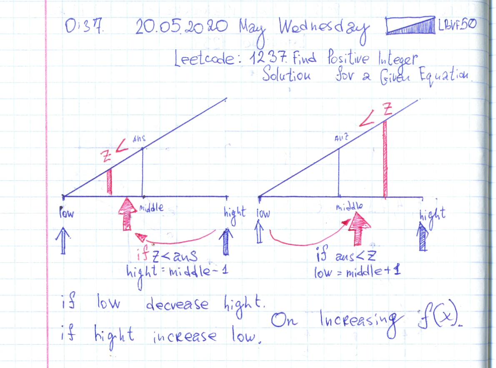

# Just PHP FUN 001. Codesignal: Paint Houses. Leetcode: 1237. Find Positive Integer Solution for a Given Equation.


## Codesingal: Paint Houses.

Pull DP.

Color for current home price is this color price + minimum from other color prices from previous home.  Answer is minimum price of the last home. All program is loop over all houses except first one.

- [about pull/push DP techniques](https://youtu.be/YBSt1jYwVfU).
- [Book with clear DP explanation](https://www.byte-by-byte.com/dpbook/).

Ruby code:
```Ruby
# https://app.codesignal.com/interview-practice/task/idSmSy6u2LNiNDjKw
def paintHouses(cost)
    (1...cost.size).each do |i|
        # Red.
        cost[i][0] += [cost[i-1][1], cost[i-1][2]].min
        # Blue.
        cost[i][1] += [cost[i-1][0], cost[i-1][2]].min
        # Green.
        cost[i][2] += [cost[i-1][0], cost[i-1][1]].min
    end
    cost.last.min
end
```

## Just PHP FUN 001.

- https://gist.github.com/lbvf50mobile/9743f00c1be0369a10fa016ed9c4278a#just-php-fun-001


## Leetcode: 1237. Find Positive Integer Solution for a Given Equation.

- https://leetcode.com/problems/find-positive-integer-solution-for-a-given-equation/
- https://gist.github.com/lbvf50mobile/9da9920c85fc6cb4d5f5b21361a7138a

In loop iterate all over the `x` values from 1 to 1000. On each `x` value check o `z` in bounds `f(x,1) <= z <= f(x,100)`.
If z in bounds.  Make a binary search on function `g(y) = f(x,y)` where `x` is a constant for current iteration.




```Ruby
# Leetcode: 1237. Find Positive Integer Solution for a Given Equation.
# https://leetcode.com/problems/find-positive-integer-solution-for-a-given-equation/
# Runtime: 56 ms, faster than 50.00% of Ruby online submissions for Find Positive Integer Solution for a Given Equation.
# Memory Usage: 9.1 MB, less than 100.00% of Ruby online submissions for Find Positive Integer Solution for a Given Equation.
# 	This is the custom function interface.
#	You should not implement it, or speculate about its implementation
#	class CustomFunction:
#		def f(self, x, y):
# 			Returns f(x, y) for any given positive integers x and y.
# 			Note that f(x, y) is increasing with respect to both x and y.
# 			i.e. f(x, y) < f(x + 1, y), f(x, y) < f(x, y + 1)
# 		end
# 	end
# 

# @param {CustomFunction} customfunction
# @param {Integer} z
# @return {List[List[Integer]]}
def findSolution(f, z)
    answer = []
    (1..1000).each do |x|
        bottom, top = f.f(x,1), f.f(x,1000)
        has_answer = z.between?(bottom,top)
        next if ! has_answer
        l = 1
        h = 1000
        while l <= h
            mid = (l+h)/2
            y = mid
            ans = f.f(x,y)
            if z == ans
                answer.push([x,y])
                break
            end
            if  ans < z
                l = mid + 1
            else
                h = mid - 1 
            end
        end
    end
    answer
end
```