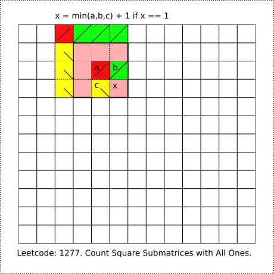

# Leetcode: 1277. Count Square Submatrices with All Ones. Bottom-Up DP.

- https://leetcode.com/problems/count-square-submatrices-with-all-ones/


**Ruby: Bottom-Up Iteration.**

Each square counted by a bottom right corner. An input array is used for DP, each cell contains amount of squares which has it bottom right element located in this cell, this is a size of the side of the largest square that counted by the cell at the same time.  Value of a cell will be calculated from values of three already visited cells around this cell: top-left, top and a left one.  From the squares size in those visited could be calculated size of a current larges square of this cell, it would be minimum side from those squares plus one. Bottom-Up because starting from small squares and rise to a big ones.




Ruby code:
```Ruby
# Leetcode: 1277. Count Square Submatrices with All Ones.
# https://leetcode.com/problems/count-square-submatrices-with-all-ones/
# @param {Integer[][]} matrix
# @return {Integer}
def count_squares(matrix)
    count = 0
    (0...matrix.size).each do |i|
        (0...matrix[0].size).each do |j|
            next if matrix[i][j].zero?
            a = i - 1 >= 0 && j - 1 >= 0 ? matrix[i-1][j-1] : 0
            b = i - 1 >= 0 ? matrix[i-1][j] : 0
            c = j - 1 >= 0 ? matrix[i][j-1] : 0
            matrix[i][j] = [a,b,c].min + 1
            count += matrix[i][j]
        end
    end
    count
end
```