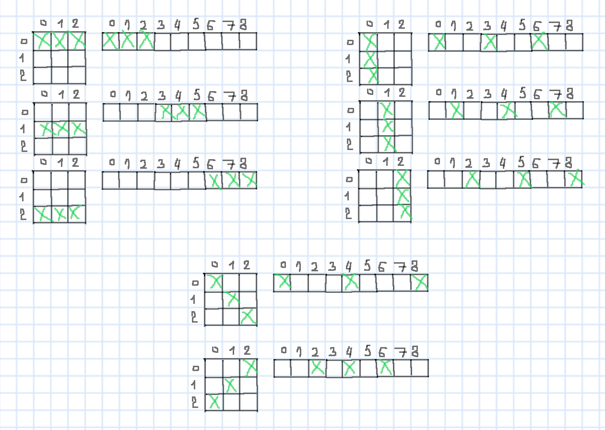

# Leetcode: 794. Valid Tic-Tac-Toe State.

- https://leetcode.com/problems/valid-tic-tac-toe-state/
- https://gist.github.com/lbvf50mobile/f13743dde4696cbf09124925d05bbb6c
- https://leetcode.com/problems/valid-tic-tac-toe-state/discuss/1137645/Ruby%3A-Get-statistic-filter-if-win-recursion-for-rest.

**Ruby: Get statistic, filter if win, recursion for rest.**

First acquire statistic number of symbols and check wins. If both types wins it is an error. If `X` wins number of `X` is greater by 1 then number of `O`. If `O` wins number of `X` and `O` are equal. After finishing working with wins, run recursive functions that pics `X` and `O` in turns, and check if finish is correct. When there is no one type of symbols to select, there must no be unselected symbols.   

Convert grid to a binary representation an integer, where selected bits are marks.   




Ruby code:
```Ruby
# Leetcode: 794. Valid Tic-Tac-Toe State.
# https://leetcode.com/problems/valid-tic-tac-toe-state/
# Runtime: 52 ms, faster than 100.00% of Ruby online submissions for Valid Tic-Tac-Toe State.
# Memory Usage: 210.1 MB, less than 100.00% of Ruby online submissions for Valid Tic-Tac-Toe State.
# Thanks God!
# @param {String[]} board
# @return {Boolean}
def valid_tic_tac_toe(board)
    @b = board.map(&:chars).flatten
    @xw,@yw = false, false # x win, y win;
    @xn, @yn = 0,0
    @marks_mask = 0
    get_stat()
    return false if @xw && @yw
    if @xw
        return @xn == @yn + 1
    end
    if @yw
        return @yn == @xn
    end
    return check(true,0, 0, 0)
end

# xm - x_marks;
# ym - y_marks;
# am - all_marks;

def check(x_turn, xm, ym, am)
    char = x_turn ? ?X : ?O
    # p "#{char} #{am.to_s(2)}"
    nt = ! x_turn # next turn;
    cm = x_turn ? xm : ym # current mark;
     (0...9).reverse_each do |i|
        bit = 1 << (8 - i)
        # Need to select only unmarked!
        if @b[i] == char && (0 == bit & am)
            nm = cm | bit # next mark;
            ng = am | bit # next global;
            return (x_turn ? check(nt,nm,ym,ng) : check(nt,xm,nm,ng))
        end
    end
    check_no_unmarked(am)
end

def check_win(marks)
    [7, 56, 448, 292, 146, 73, 273, 84].any?{|x| 0 == ((marks & x) ^ x)}
end

def get_stat()
    xm, ym = 0,0
    (0...9).reverse_each do |i|
        if ?X == @b[i] || ?O == @b[i]
            bit = (1 << (8-i))
            @marks_mask = @marks_mask | bit
            if ?X == @b[i]
                xm = xm | bit 
                @xn += 1 
                @xw = true if check_win(xm)
            end
            if ?O == @b[i]
                ym = ym | bit
                @yn += 1
                @yw = true  if check_win(ym)
            end
        end
    end
end
def check_no_unmarked(mask)
    0 == (mask ^ @marks_mask)
end

```