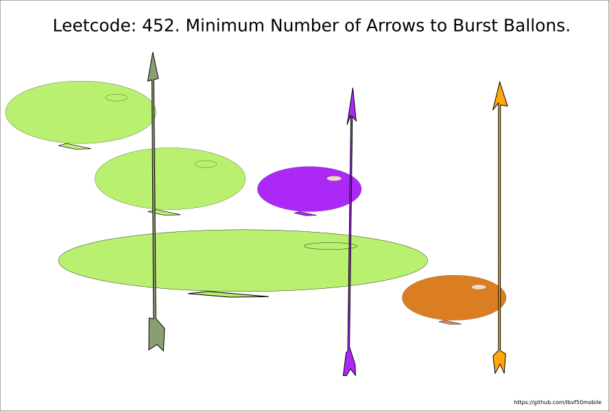

# Leetcode: 452. Minimum Number of Arrows to Burst Balloons.

- https://gist.github.com/lbvf50mobile/f2e2449922a86250b7467a1cc7047d0b

**Ruby: Always shoot the right side.**

Sort ballons by the end. This means the right side of a ballon will be before the next ballons or within their area. Thus if shoot at the right side of a ballon we could find do the next ones are burst, just saving the position of the last arrow.

If the next one is not burst, just shoot its right side. That's all.



Really appreciate https://leetcode.com/linfq/ for solution and [briliant explanation](https://leetcode.com/problems/minimum-number-of-arrows-to-burst-balloons/discuss/1686627/C%2B%2BJavaPython-6-Lines-oror-Sort-and-Greedy-oror-Image-Explanation).

Ruby code:
```Ruby
# Leetcode: 452. Minimum Number of Arrows to Burst Balloons.
# https://leetcode.com/problems/minimum-number-of-arrows-to-burst-balloons/
# = = = = = = =
# Accepted.
# Thanks God!
# = = = = = = =
# Runtime: 293 ms, faster than 57.14% of Ruby online submissions for Minimum Number of Arrows to Burst Balloons.
# Memory Usage: 223 MB, less than 28.57% of Ruby online submissions for Minimum Number of Arrows to Burst Balloons.
# @param {Integer[][]} points
# @return {Integer}
def find_min_arrow_shots(points)
  # Solution based on:
  # https://leetcode.com/problems/minimum-number-of-arrows-to-burst-balloons/discuss/1686627/C%2B%2BJavaPython-6-Lines-oror-Sort-and-Greedy-oror-Image-Explanation
  x = points.sort_by(&:last)
  ans, arrow = 0, 0
  x.each do |(start,finish)|
    if 0 == ans || start > arrow
      ans += 1
      arrow = finish
    end
  end
  ans
end
```
