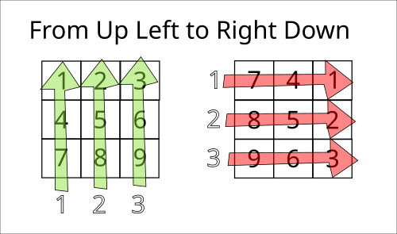

# Leetcode: 48. Rotate Image.

- https://gist.github.com/lbvf50mobile/4a30b128117910e97f46d7d480b8d92f
- https://leetcode.com/problems/rotate-image/discuss/2505798/Ruby%3A-From-Up-Right-to-Left-Down.

**Ruby: From Up Right to Left Down.**

*Q: Why do you write? UpRight and LeftDown when cells from source first move rigtht then top and puth into destination firs moving left then down?*  
*A: It whas my first drawing when I got how to solve this task. At the left part there was an input matrix at the right part output one, and I found that ROWS source go up and ROWS from destination go down. And in assignment desitnation is left and source is right. This slogan UpRight to LeftDown just sounds good.*   

```
      dest[i_to][j_to] = source[i_from][j_from]
```



Copy current matrix to a temporary one.
Create two loops outer and inner, and copy from the temp matrix to the current one.

From:  
Outer 0..n column.  
Inner n..0 row.  
To:  
Outer 0..n row.  
Innter 0..n column.  

Let's try.

Ruby code:
```Ruby
# Leetcode: 48. Rotate Image.
# https://leetcode.com/problems/rotate-image/
# = = = = = = = = = = = = = =
# Accepted.
# Thanks God, Jesus Christ!
# = = = = = = = = = = = = = =
# Runtime: 148 ms, faster than 18.48% of Ruby online submissions for Rotate Image.
# Memory Usage: 211 MB, less than 81.52% of Ruby online submissions for Rotate Image.
# @param {Integer[][]} matrix
# @return {Void} Do not return anything, modify matrix in-place instead.
def rotate(matrix)
  dest = matrix
  source = Array.new(matrix.size).map.with_index{|_,i| matrix[i].clone}
  n = matrix.size
  j_from = 0 # Outer column O...n;
  i_to = 0 # Outer row 0...n;
  n.times do
    i_from = n - 1 # Inner row n...0;
    j_to = 0 # Inner column 0...n;
    n.times do 
      dest[i_to][j_to] = source[i_from][j_from]
      i_from -= 1
      j_to += 1
    end
    j_from += 1
    i_to += 1
  end
end
```
