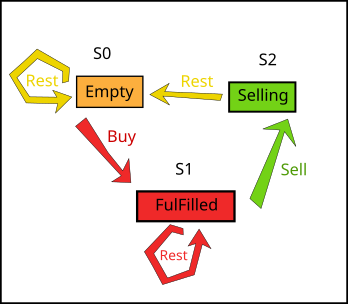

# Leetcode: 309. Best Time to Buy and Sell Stock with Cooldown.

- https://gist.github.com/lbvf50mobile/a93c63a32d9459c2d5491bcdfd2e48fb
- https://leetcode.com/problems/best-time-to-buy-and-sell-stock-with-cooldown/discuss/2943363/RubyGo%3A-Traveling-between-three-possible-states.-Pull-DP.

**Ruby/Go: Traveling between three possible states. Pull DP.**

This solution is based on the [Phat Nguyen's solution](https://leetcode.com/problems/best-time-to-buy-and-sell-stock-with-cooldown/discuss/75928/Share-my-DP-solution-(By-State-Machine-Thinking)).

There are three possible states. Each day cold be in one of these states.



- 0. `Empty state`. Nothing to sell do nothign.
- 1. `Full state`. Have something to sell but do nothing. When buy something the day marked as a `Full state`, there no separate `Buy state`.
- 2. `Sell state`. `Sell state` can be only after `Full state` when have something to buy. A `Sell state` can fill only one day.

This solution based on Pull DP where data copied from the previos indices of an array, but the savory of this task is here several arrays.

- `Empty state` could copy from `Empty state` or from `Sell state`. 
- `Full state` could happens only after `Empty state` - the buy day, or just continue `Full state`.
- `Sell state` could copy only from a previous `Full State`.

The arrays store profit during these days. More in comments in the source code.

Ruby code:
```Ruby
# Leetcode: 309. Best Time to Buy and Sell Stock with Cooldown.
# https://leetcode.com/problems/best-time-to-buy-and-sell-stock-with-cooldown/
# = = = = = = = = = = = = = =
# Accepted.
# Thanks God, Jesus Christ!
# = = = = = = = = = = = = = =
# Runtime: 90 ms, faster than 85.71% of Ruby online submissions for Best Time to Buy and Sell Stock with Cooldown.
# Memory Usage: 211.4 MB, less than 14.29% of Ruby online submissions for Best Time to Buy and Sell Stock with Cooldown.
# 2022.12.23 Daily Challenge.
# @param {Integer[]} prices
# @return {Integer}
def max_profit(prices)
  # Based on:
  # https://leetcode.com/problems/best-time-to-buy-and-sell-stock-with-cooldown/discuss/75928/Share-my-DP-solution-(By-State-Machine-Thinking)
  return 0 if prices.empty?
  n = prices.size
  # Element of the array is amount of money earned.
  s0 = Array.new(n,0) # Do nothing day.
  s1 = Array.new(n,0) # Buying day (Or staing fullfilled).
  s2 = Array.new(n,0) # Selling day.
  s0[0] = 0 # Do nothing, have noting.
  s1[0] = - prices[0] # Buy and spend money.
  s2[0] = - Float::INFINITY # Superminimum have nothing to sell.
  (1...n).each do |j|
    i = j - 1
    s0[j] = [s0[i], s2[i]].max
    s1[j] = [s1[i],s0[i] - prices[j]].max
    s2[j] = s1[i] + prices[j]
  end
  [s0.last,s1.last,s2.last].max
end
```

Go code:
```Go
// Leetcode: 309. Best Time to Buy and Sell Stock with Cooldown.
// https://leetcode.com/problems/best-time-to-buy-and-sell-stock-with-cooldown/
// = = = = = = = = = = = = = =
// Accepted.
// Thanks God, Jesus Christ!
// = = = = = = = = = = = = = =
// Runtime: 0 ms, faster than 100.00% of Go online submissions for Best Time to Buy and Sell Stock with Cooldown.
// Memory Usage: 2.3 MB, less than 60.42% of Go online submissions for Best Time to Buy and Sell Stock with Cooldown.
// 2022.12.23 Daily Challenge.
func maxProfit(prices []int) int {
  n := len(prices)
  if 0 == n { return 0 }
  l := n - 1
  // Each array contain profit.
  s0 := make([]int,n) // Do nothing day. Have nothing.
  s1 := make([]int,n) // Buy day. Have someting. 
  s2 := make([]int,n) // Sell something.
  s0[0] = 0 // First day do nothing. 0 profit.
  s1[0] = - prices[0] // Buy something, state having something.
  s2[0] = - 10000 // Selling day. Set minimum to not select.
  for j := 1 ; j < n ; j += 1{
    i := j - 1
    s0[j] = max(s0[i],s2[i]) 
    s1[j] = max(s0[i] - prices[j], s1[i])
    s2[j] = s1[i] + prices[j]
  }
  return max3(s0[l],s1[l],s2[l])
}

func max(a,b int) int{
  if a > b {
    return a 
  } else {
    return b
  }
}
func max3(a,b,c int) int {
  ans := a 
  if b > ans { ans = b }
  if c > ans { ans = c }
  return ans
}
```
