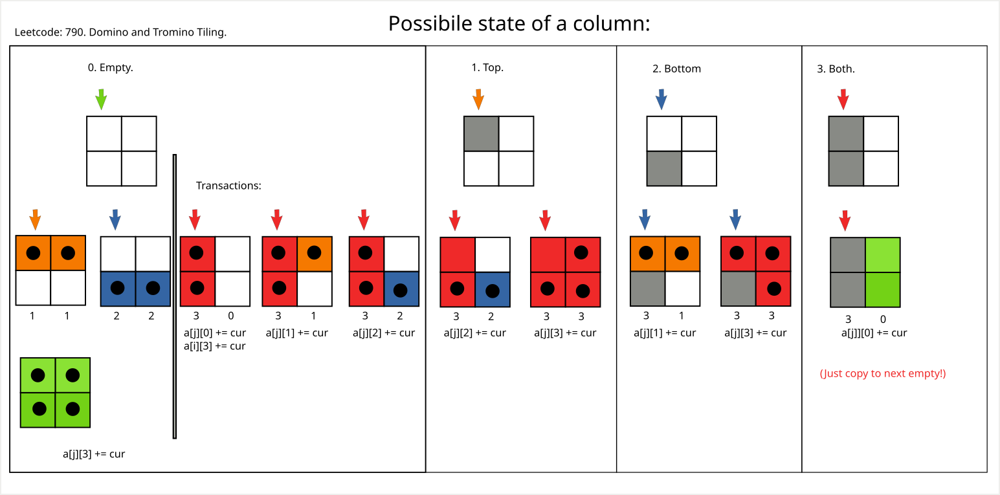

# Leetcode: 790. Domino and Tromino Tiling.

- https://gist.github.com/lbvf50mobile/1036c43bc08cf884c37ecbdf5286f65c
- https://leetcode.com/problems/domino-and-tromino-tiling/discuss/2947201/RubyGo%3A-img-Push-DP.-Column-has-four-states.

**Ruby/Go: [img] Push DP. Column has four states.**

Basic approach: There four cases how to fill two elements column, each of these cases is a state.
From state of columnt `i` and number of ways this state is reached to appropriate state of the `i+1` column.



- 0. Empty state. Top and bottom cells are empty.
- 1. Top state. Top cell is filled.
- 2. Bottom state. Bottom cell is filled.
- 3. Both state. Both cells are filled.

**UPD**: More concise and elegant [soution](https://leetcode.com/problems/domino-and-tromino-tiling/discuss/1622119/Ruby%3A-Push-DP-ways-to-fill-a-column) based on same principles, were return empty state after the last `dp[n+1][0]`.

Transaction from each states are. Such way to close all gaps at `i` and some gaps at `j`.

- 0. Empty state. Put two horizontal dominos. One vertical. Or one trimino both ways.
- 1. Top state. Put horizontal domino at the bootom or trimino. 
- 2. Bottom state. Put horisontal domino at the top or timino.
- 3. From the Both state, only way it just move to the zero state of the next collumn.

Empty state is only state when transaction not only modify `j` column, but also modify a `Both` state at current `i` collumn. 
Because of that, need to firt calculate `Both state` in the loop, to avoid double count if `Both state` of `i` increased when two horizontal dominos are used.

Ruby code:
```Ruby
# Leetcode: 790. Domino and Tromino Tiling.
# https://leetcode.com/problems/domino-and-tromino-tiling/
# = = = = = = = = = = = = = =
# Accepted.
# Thanks God, Jesus Christ!
# = = = = = = = = = = = = = =
# Runtime: 104 ms, faster than 100.00% of Ruby online submissions for Domino and Tromino Tiling.
# Memory Usage: 211.4 MB, less than 100.00% of Ruby online submissions for Domino and Tromino Tiling.
# 2022.12.24 Daily Challenge.
# @param {Integer} n
# @return {Integer}
def num_tilings(n)
  # Add one column in front to start indices from one.
  # Add one column at the end to aviod check in code.
  dp = Array.new(n+2).map{ Array.new(4,0)}
  x = (10**9) + 7
  dp[1][0] = 1 # There is only one way to get empty column.
  (1..n).each do |i|
    j = i + 1
    # Order is importatnt!
    # Start from state #3 "Both".
    cur = dp[i][3]
    dp[j][0] += cur
    # Continue with state #0 "Empty".
    # It is only where value for i filled as well.
    cur = dp[i][0]
    dp[j][3] += cur
    dp[j][1] += cur
    dp[j][2] += cur
    dp[j][0] += cur
    dp[i][3] += cur # Only case that one "Both" is first.
    # Continue with state #1 "Top".
    cur = dp[i][1]
    dp[j][2] += cur 
    dp[j][3] += cur
    # Continue with state #2 "Bottom".
    cur = dp[i][2]
    dp[j][1] += cur
    dp[j][3] += cur
    
    dp[i][0] %= x
    dp[i][1] %= x
    dp[i][2] %= x
    dp[i][3] %= x
    dp[j][0] %= x
    dp[j][1] %= x
    dp[j][2] %= x
    dp[j][3] %= x
  end
  return dp[n][3]
end
```
Go code:
```Go
// Leetcode: 790. Domino and Tromino Tiling.
// https://leetcode.com/problems/domino-and-tromino-tiling/
// = = = = = = = = = = = = = =
// Accepted.
// Thanks God, Jesus Christ!
// = = = = = = = = = = = = = =
// Runtime: 2 ms, faster than 37.50% of Go online submissions for Domino and Tromino Tiling.
// Memory Usage: 2.6 MB, less than 6.25% of Go online submissions for Domino and Tromino Tiling.
// 2022.12.24 Daily Challenge.
func numTilings(n int) int {
  // Create array with n+2 elements,
  // one element to work with 1-based inicies.
  // And one element to avoid out of bound checks.
  dp := make([][]int, n + 2)
  x := 1000000007
  // There are four possible states for the column.
  for i := 0 ; i < n+2 ; i += 1 {
    dp[i] = make([]int,4) 
  }
  // There is only one way to get empty states for a first row.
  dp[1][0] = 1
  for i := 1 ; i <= n ; i += 1 {
    j := i + 1
    // Beging from "Both" State.
    // Order of states is important.
    // "Both" state for i filled in "Empty" state.
    cur := dp[i][3]
    dp[j][0] += cur
    // Continue with an "Empty" State.
    cur = dp[i][0]
    dp[i][3] += cur // Put a vertical domino. On a the current column.
    dp[j][0] += cur
    dp[j][3] += cur // Two gorizontal dominos.
    dp[j][1] += cur
    dp[j][2] += cur
    // "Top" State.
    cur = dp[i][1]
    dp[j][2] += cur
    dp[j][3] += cur
    // "Bottom" State.
    cur = dp[i][2]
    dp[j][1] += cur
    dp[j][3] += cur

    dp[i][0] %= x
    dp[i][1] %= x
    dp[i][2] %= x
    dp[i][3] %= x
    dp[j][0] %= x
    dp[j][1] %= x
    dp[j][2] %= x
    dp[j][3] %= x
  }
  // Return "Both" of the last column.
  return dp[n][3]
}
```
